# 🏠 StayMate — Smart Room & Roommate Finder Platform

> **Find your perfect home and compatible roommates in minutes.**
> Connect with verified landlords, manage bookings securely, and use AI-powered matching to find people you'll love living with.

---

## ✨ Key Features

- **🏠 Property Listings**: Landlords can list properties with rich media, amenities, and location data.
- **📅 Secure Booking System**: Atomic booking requests with "Pending -> Approved -> Paid" lifecycle.
- **🤝 AI Roommate Finder**: algorithm matches users based on lifestyle, budget, and habits (`95%` compatibility target).
- **🔔 Real-time Notifications**: Instant alerts for bookings, messages, and application updates.
- **🛡️ Role-Based Access**: Specialized dashboards for **Tenants**, **Landlords**, and **Admins**.
- **💬 Integrated Messaging**: Secure, in-app chat for negotiating lease terms.

---

## 🧑🤝🧑 User & Role Overview

| Role | Responsibility | Key Interactions |
| :--- | :--- | :--- |
| **👩‍💻 User (Tenant)** | Looking for a room or roommate. | Search properties, Send/Monitor requests, Chat with landlords. |
| **🔑 House Owner** | Manages properties and leases. | Create listings, Review applications, Manage vacancies. |
| **🛡️ Admin** | Platform oversight. | Verify users, Moderate content, View system analytics. |

---

## 🔁 System Flow

### Core User Journey
The following flow demonstrates how a user goes from searching to securing a home.

```mermaid
graph TD
    A[User Visits Platform] --> B{Looking for?}

    B -->|Room/Apartment| C[Search Listings]
    B -->|Roommate| D[Browse Profiles]

    C --> E[View Details & Reviews]
    D --> F[Send Connect Request]

    E --> G[Send Booking Request]
    F --> H{Request Accepted?}

    H -- Yes --> I[Start Chatting]
    H -- No --> D

    G --> J{Owner Approves?}
    J -- Yes --> K[Make Payment]
    J -- No --> C

    K --> L[Booking Confirmed 🎉]
```



---

## 🗄️ Database Design

StayMate relies on a robust **MySQL 8.0** schema designed for data integrity and complex spatial queries.


> **Note**: Locations are stored using spatial indexing for efficient "radius search" queries.

---

## 🧠 Architecture Overview

### **Frontend**
- **Framework**: Next.js 14 (App Router)
- **Styling**: TailwindCSS + Framer Motion
- **State**: React Context + SWR

### **Backend**
- **Core**: Spring Boot 3.2 (Java 17)
- **Database**: MySQL 8.0 with Hibernate ORM
- **Object Storage**: MinIO (S3 Compatible)
- **AI Engine**: Ollama (Llama 3) for matching logic

---

## 📚 Documentation

For detailed technical guides, please visit our **[MkDocs Documentation Site](mk-docs/docs/index.md)**.

- **[🚀 Getting Started](mk-docs/docs/index.md)**: Setup and Installation.
- **[🔌 API Reference](mk-docs/docs/api/authentication.md)**: Endpoints and payloads.
- **[🗄️ Database Schema](mk-docs/docs/architecture/database.md)**: Deep dive into the data model.
- **[🧪 Load Testing](mk-docs/docs/performance/load-testing.md)**: JMeter and performance results.

---

## 🚀 Getting Started

### Prerequisites
- **Docker & Docker Compose**
- **Java 17+** (for local dev)
- **Node.js 18+** (for local frontend)

### Quick Start (Docker)
Run the full stack (DB, Backend, Frontend, MinIO) with one command:

```bash
docker-compose up -d --build
```

- **Frontend**: [http://localhost:3000](http://localhost:3000)
- **Backend API**: [http://localhost:8080](http://localhost:8080)
- **MinIO Console**: [http://localhost:9006](http://localhost:9006)

### Manual Local Dev
1. **Infrastructure**: `docker-compose up -d mysql-db minio`
2. **Backend**: `./mvnw spring-boot:run`
3. **Frontend**: `npm run dev` in `/frontend`

---

## 🧪 Testing & QA

We use a mix of unit, integration, and load testing to ensure stability.

- **Unit Tests**: JUnit 5 for backend logic.
- **Load Tests**: [Locust](./staymate-load-test/) scripts for simulating 10k+ concurrent users.

To run load tests:
```bash
cd staymate-load-test
pip install locust
locust -f locustfile.py --host=http://localhost:8080
```

---

## 🌐 Deployment

The system is production-ready for **AWS EC2**.
- **CI/CD**: GitHub Actions pipeline builds Docker images.
- **Reverse Proxy**: Nginx handles SSL termination and routing.
- **Secrets**: Managed via environment variables (clean `.env` separation).

See **[DEPLOYMENT.md](DEPLOYMENT.md)** for the full AWS guide.

---

## 🤝 Contribution Guidelines

We welcome contributions! Please follow these steps:

1.  **Fork** the repository.
2.  Create a **feature branch**: `git checkout -b feature/amazing-feature`.
3.  Commit changes: `git commit -m 'Add amazing feature'`.
4.  **Push** to branch: `git push origin feature/amazing-feature`.
5.  Open a **Pull Request**.

Please ensure all tests pass before submitting.

---

<p align="center">
  Built with ❤️ by the StayMate Team
</p>
