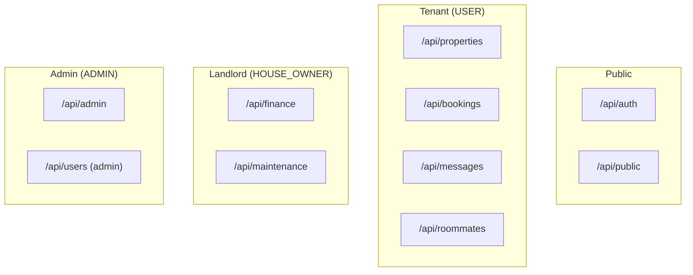

# API Reference

Role-aware API documentation for StayMate's 148 endpoints.

---

## API Design Principles

- **RESTful**: Resource-oriented URLs
- **JSON**: All request/response bodies
- **JWT**: Bearer token authentication
- **RBAC**: Role-based endpoint access
- **Consistent**: Standard error responses

---

## Base URL

```
Production: https://api.staymate.com
Development: http://localhost:8080
```

---

## Authentication

```http
Authorization: Bearer <access_token>
```

See [JWT Lifecycle](../security/jwt-lifecycle.md) for token management.

---

## Endpoint Categories



---

## In This Section

| Document | Endpoints | Target Role |
|----------|-----------|-------------|
| [Authentication](auth.md) | 8 | Public/All |
| [Tenant API](tenant.md) | 60+ | USER |
| [Landlord API](landlord.md) | 30+ | HOUSE_OWNER |
| [Admin API](admin.md) | 25+ | ADMIN |
| [Versioning](versioning.md) | — | Reference |
| [Error Contracts](error-contracts.md) | — | Reference |

---

## Quick Reference

| Method | Meaning |
|--------|---------|
| `GET` | Retrieve resource(s) |
| `POST` | Create resource |
| `PUT` | Full update |
| `PATCH` | Partial update |
| `DELETE` | Remove resource |

---

## Common Headers

| Header | Value | Required |
|--------|-------|----------|
| `Authorization` | `Bearer <token>` | Most endpoints |
| `Content-Type` | `application/json` | POST/PUT/PATCH |
| `Accept` | `application/json` | Recommended |
