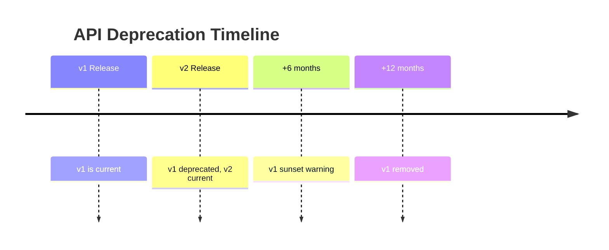

# API Versioning

API versioning strategy and compatibility guidelines.

---

## Current Version

**v1** — All current endpoints are version 1.

---

## Versioning Strategy

!!! info "Design Decision"
    StayMate uses **URL-based versioning** for explicit version control:

    ```
    /api/v1/properties
    /api/v2/properties  (future)
    ```

    Currently, the `/api/` prefix implies v1.

---

## Alternative Strategies Considered

| Strategy | Example | Pros | Cons |
|----------|---------|------|------|
| **URL Path** ✅ | `/api/v1/...` | Explicit, cacheable | URL changes |
| Header | `Accept-Version: 1` | Clean URLs | Less discoverable |
| Query | `?version=1` | Easy to add | Not RESTful |

---

## Compatibility Rules

### Non-Breaking Changes (Minor)

These can be added without version bump:

- Adding new endpoints
- Adding optional request fields
- Adding response fields
- Adding new enum values

### Breaking Changes (Major)

These require a new version:

- Removing endpoints
- Removing/renaming fields
- Changing field types
- Changing endpoint URLs
- Changing authentication

---

## Deprecation Policy



### Deprecation Headers

```http
HTTP/1.1 200 OK
Deprecation: true
Sunset: Sat, 01 Jan 2025 00:00:00 GMT
Link: <https://api.staymate.com/api/v2/properties>; rel="successor-version"
```

---

## Migration Guide Template

When v2 is released:

| v1 Endpoint | v2 Endpoint | Changes |
|-------------|-------------|---------|
| `GET /api/properties` | `GET /api/v2/properties` | Pagination format |
| `POST /api/bookings` | `POST /api/v2/bookings` | New required field |

---

## SDK Versioning

Future client SDKs will match API versions:

```javascript
// JavaScript SDK
import { StayMateClient } from '@staymate/sdk-v1';

const client = new StayMateClient({
  apiVersion: 'v1',
  baseUrl: 'https://api.staymate.com'
});
```
