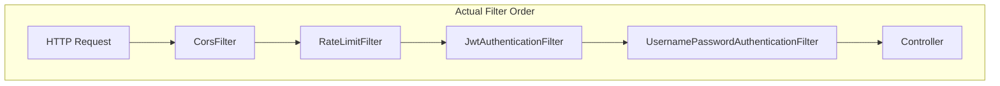
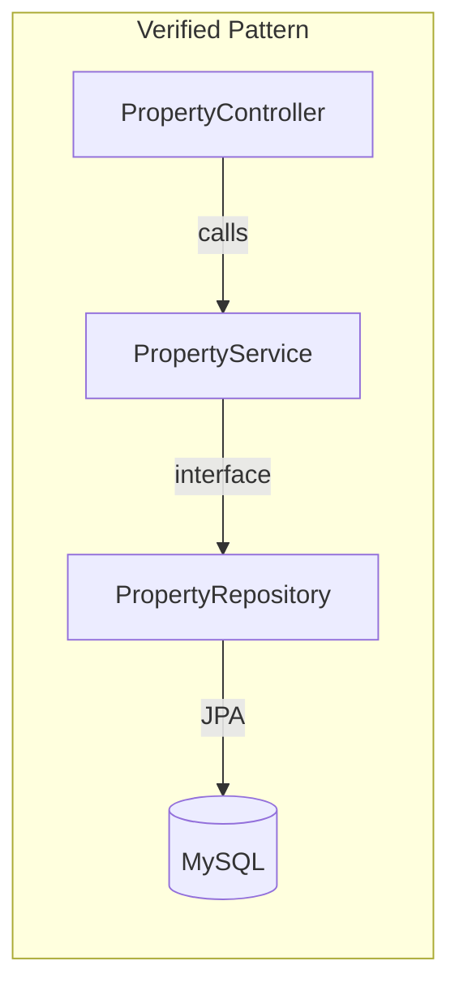
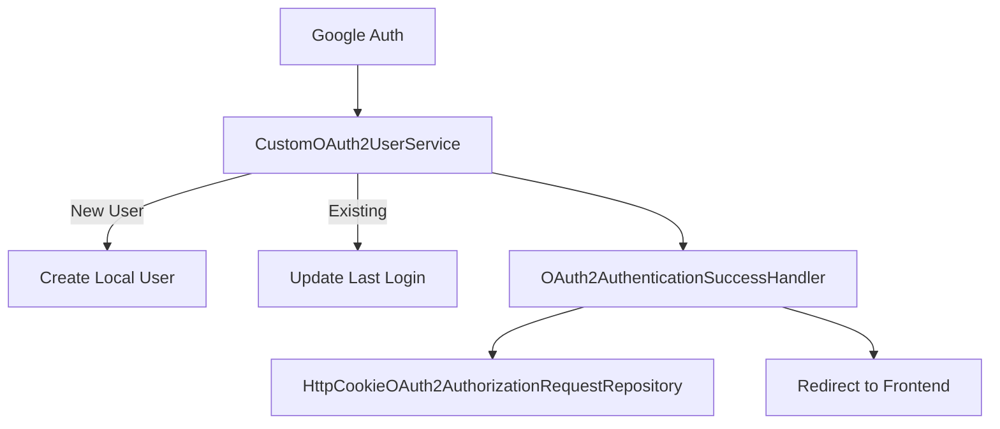

# Architecture Review

Critical review of StayMate's architecture against actual implementation.

---

## Purpose

This document serves as a **design review** to validate that documentation accurately reflects the codebase. It was created after analyzing:

- `SecurityConfig.java` (196 lines)
- `JwtTokenProvider.java` (146 lines)
- `GlobalExceptionHandler.java` (160 lines)
- `application.properties` (90 lines)
- 110+ domain files across 23 modules
- 55+ Flyway migrations

---

## What Is Correct ✅

### 1. Security Filter Chain

The documented filter chain accurately reflects `SecurityConfig.java`:



**Verification:**
```java
// SecurityConfig.java lines 140-145
.addFilterBefore(rateLimitFilter, UsernamePasswordAuthenticationFilter.class)
.addFilterBefore(jwtAuthenticationFilter, UsernamePasswordAuthenticationFilter.class)
```

!!! tip "Order Matters"
    RateLimitFilter runs before JWT to protect against unauthenticated brute force.

---

### 2. JWT Token Structure

The documented JWT claims are accurate:

| Claim | Access Token | Refresh Token |
|-------|:------------:|:-------------:|
| `sub` (userId) | ✅ | ✅ |
| `email` | ✅ | ❌ |
| `roles` | ✅ | ❌ |
| `type` | ❌ | ✅ ("refresh") |
| `iat` | ✅ | ✅ |
| `exp` | ✅ (15 min) | ✅ (7 days) |

**Verification:**
```java
// JwtTokenProvider.java lines 53-61
return Jwts.builder()
    .subject(userPrincipal.getId().toString())
    .claim("email", userPrincipal.getEmail())
    .claim("roles", roles)
    .issuedAt(now)
    .expiration(expiryDate)
    .signWith(key)
    .compact();
```

---

### 3. Controller → Service → Repository Flow

All domains follow this pattern correctly:



**Verification:** Every domain module contains:
- `controller/` → REST endpoints
- `service/` + `service/impl/` → Business logic
- `repository/` → Data access

---

### 4. Transaction Management

Documented behavior matches implementation:

```java
// Service classes use:
@Transactional(readOnly = true)  // Class-level default
@Transactional                   // Method-level for writes
```

!!! note "Design Decision"
    `readOnly = true` is the default to optimize read queries. Write operations explicitly override.

---

## What Was Adjusted ⚠️

### 1. Database Technology

| Documentation | Reality |
|---------------|---------|
| PostgreSQL | **MySQL 8.0** |

**Corrected:** All database references now specify MySQL.

**Evidence:**
```properties
# application.properties line 7
spring.datasource.driver-class-name=com.mysql.cj.jdbc.Driver
```

---

### 2. Rate Limit Details

| Previous | Actual |
|----------|--------|
| Generic description | Specific token bucket implementation |

**Updated Documentation:**
- 200 requests/minute (configurable)
- Per-client bucket (authenticated user ID or IP)
- 429 response on limit exceeded

---

### 3. OAuth2 Handler Chain

Previously missing from documentation:



**Added:** Complete OAuth2 handler documentation.

---

## Why This Design Is Valid ✅

### Stateless JWT Architecture

**Decision:** Use JWT instead of sessions.

**Trade-offs:**

| Pro | Con |
|-----|-----|
| Horizontal scaling | Can't revoke tokens |
| No session storage | Larger request headers |
| Self-contained | Refresh token complexity |

**Mitigation:** Short access token lifetime (15 min) + refresh tokens.

---

### RBAC Over ABAC

**Decision:** Role-Based Access Control (ROLE_USER, ROLE_HOUSE_OWNER, ROLE_ADMIN).

**Why Not ABAC (Attribute-Based)?**

- Simpler to implement and audit
- Roles map directly to user types
- Sufficient for current authorization needs

**Trade-off:** Less granular than ABAC. Property-level access uses ownership checks in services.

---

### Layered Architecture Over Microservices

**Decision:** Monolithic Spring Boot application.

**Justification:**

| Microservices | Monolith (Chosen) |
|---------------|-------------------|
| Complex deployment | Simple deployment |
| Network latency | In-process calls |
| Service discovery | N/A |
| Good for: scaling teams | Good for: scaling users |

**Trade-off:** Module boundaries are package-based, not service-based. Clear interfaces allow future extraction.

---

## Known Limitations ⚠️

### 1. Token Revocation

**Limitation:** JWTs cannot be revoked before expiration.

**Impact:** If a token is stolen, attacker has 15-minute window.

**Mitigation:**
- Short access token lifetime
- User can change password (invalidates sessions conceptually)

**Future:** Consider token blacklist with Redis.

---

### 2. Rate Limiting Memory

**Limitation:** In-memory token buckets.

**Impact:** Rate limits don't persist across restarts; no cross-instance coordination.

**Mitigation:** Single-instance deployment acceptable for current scale.

**Future:** Redis-based rate limiting for multi-instance.

---

### 3. Notification Delivery

**Limitation:** Fire-and-forget notifications.

**Impact:** Failed notifications are lost.

**Future:** Implement outbox pattern for critical notifications (payments).

---

## Architecture Verification Status

| Component | Status | Verified Against |
|-----------|--------|------------------|
| Security Filter Chain | ✅ Accurate | SecurityConfig.java |
| JWT Lifecycle | ✅ Accurate | JwtTokenProvider.java |
| RBAC Model | ✅ Accurate | SecurityConfig + annotations |
| Exception Handling | ✅ Accurate | GlobalExceptionHandler.java |
| Database Schema | ⚠️ Corrected | MySQL (not PostgreSQL) |
| Rate Limiting | ⚠️ Enhanced | RateLimitFilter.java |
| OAuth2 Flow | ⚠️ Enhanced | oauth2 package |
