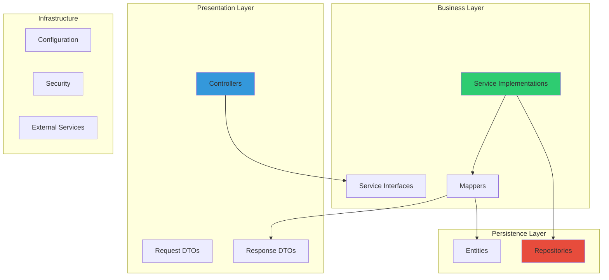

# Clean Architecture

StayMate follows a **layered clean architecture** pattern with strict dependency rules.

---

## Layer Overview



---

## Dependency Rule

!!! warning "Critical Principle"
    Dependencies flow **inward** only:

    - Controllers depend on Services
    - Services depend on Repositories
    - Repositories depend on Entities
    - **No layer depends on an outer layer**

---

## Package Structure

```
com.webapp/
├── Application.java                 # Spring Boot entry point
│
├── auth/                            # Authentication module
│   ├── config/
│   │   ├── SecurityConfig.java      # HTTP security chain
│   │   ├── RateLimitFilter.java     # Token bucket rate limiting
│   │   └── WebSocketConfig.java     # WS configuration
│   ├── controller/
│   │   └── AuthController.java      # /api/auth endpoints
│   ├── dto/
│   │   ├── request/                 # LoginRequest, RegisterRequest
│   │   └── response/                # AuthResponse
│   ├── security/
│   │   ├── JwtAuthenticationFilter.java
│   │   ├── JwtTokenProvider.java
│   │   └── oauth2/                  # Google OAuth2
│   ├── service/
│   │   └── impl/AuthServiceImpl.java
│   └── exception/
│       └── GlobalExceptionHandler.java
│
├── domain/                          # Business domains
│   ├── property/
│   │   ├── controller/PropertyController.java
│   │   ├── dto/
│   │   ├── entity/Property.java
│   │   ├── repository/PropertyRepository.java
│   │   ├── service/PropertyService.java
│   │   └── mapper/PropertyMapper.java
│   ├── booking/
│   ├── finance/
│   └── ... (23 total domains)
│
└── config/                          # Global configuration
```

---

## Layer Responsibilities

### Controller Layer

```java
@RestController
@RequestMapping("/api/properties")
@RequiredArgsConstructor
public class PropertyController {

    private final PropertyService propertyService;  // Service interface

    @PostMapping
    @PreAuthorize("hasRole('HOUSE_OWNER')")
    public ResponseEntity<PropertyResponse> create(
            @Valid @RequestBody CreatePropertyRequest request) {
        return ResponseEntity.status(HttpStatus.CREATED)
                .body(propertyService.createProperty(request));
    }
}
```

**Responsibilities:**

- HTTP request/response handling
- Input validation (`@Valid`)
- Authorization (`@PreAuthorize`)
- Delegate to service layer

**Does NOT:**

- Contain business logic
- Access repositories directly
- Handle entity transformations

---

### Service Layer

```java
@Service
@RequiredArgsConstructor
@Transactional(readOnly = true)
public class PropertyServiceImpl implements PropertyService {

    private final PropertyRepository propertyRepository;
    private final PropertyMapper propertyMapper;
    private final UserService userService;

    @Override
    @Transactional
    public PropertyResponse createProperty(CreatePropertyRequest request) {
        User owner = userService.getCurrentUser();

        Property property = propertyMapper.toEntity(request);
        property.setOwner(owner);
        property.setStatus(PropertyStatus.PENDING_REVIEW);

        Property saved = propertyRepository.save(property);
        return propertyMapper.toResponse(saved);
    }
}
```

**Responsibilities:**

- Business logic
- Transaction management
- Entity ↔ DTO mapping (via mappers)
- Orchestration of multiple repositories

---

### Repository Layer

```java
public interface PropertyRepository extends JpaRepository<Property, Long> {

    Page<Property> findByOwner(User owner, Pageable pageable);

    @Query("SELECT p FROM Property p WHERE p.status = :status")
    List<Property> findByStatus(@Param("status") PropertyStatus status);

    boolean existsByIdAndOwner(Long id, User owner);
}
```

**Responsibilities:**

- Data access abstraction
- Query definitions
- Pagination support

---

## Benefits

| Benefit | How Achieved |
|---------|--------------|
| **Testability** | Mock service interfaces in controller tests |
| **Maintainability** | Changes isolated to specific layer |
| **Flexibility** | Swap implementations without affecting other layers |
| **Readability** | Clear responsibility boundaries |
