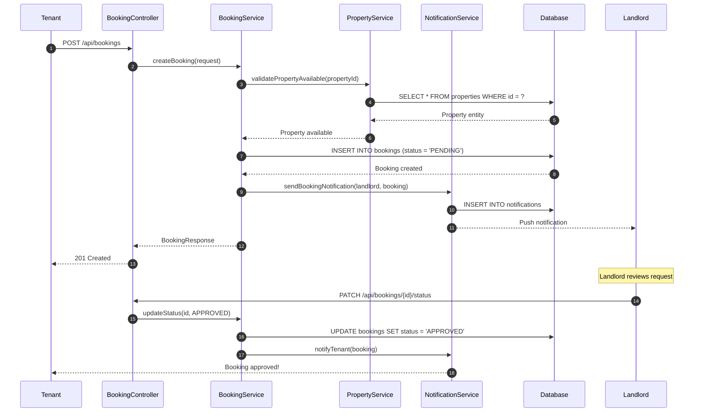
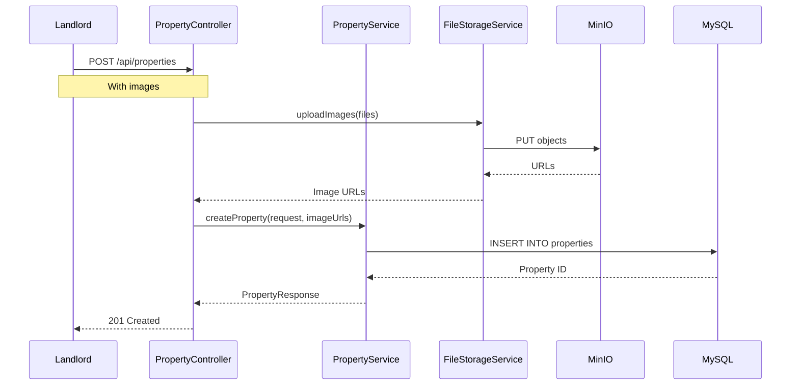
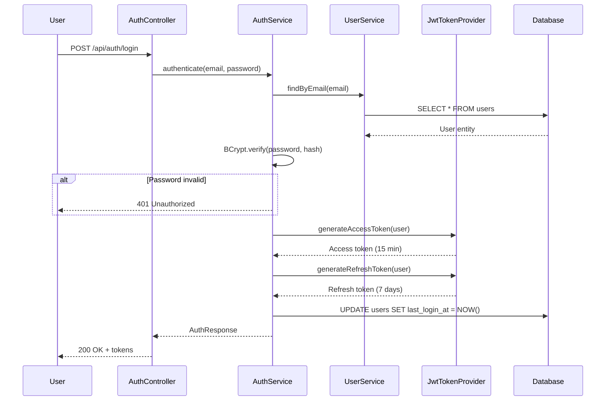
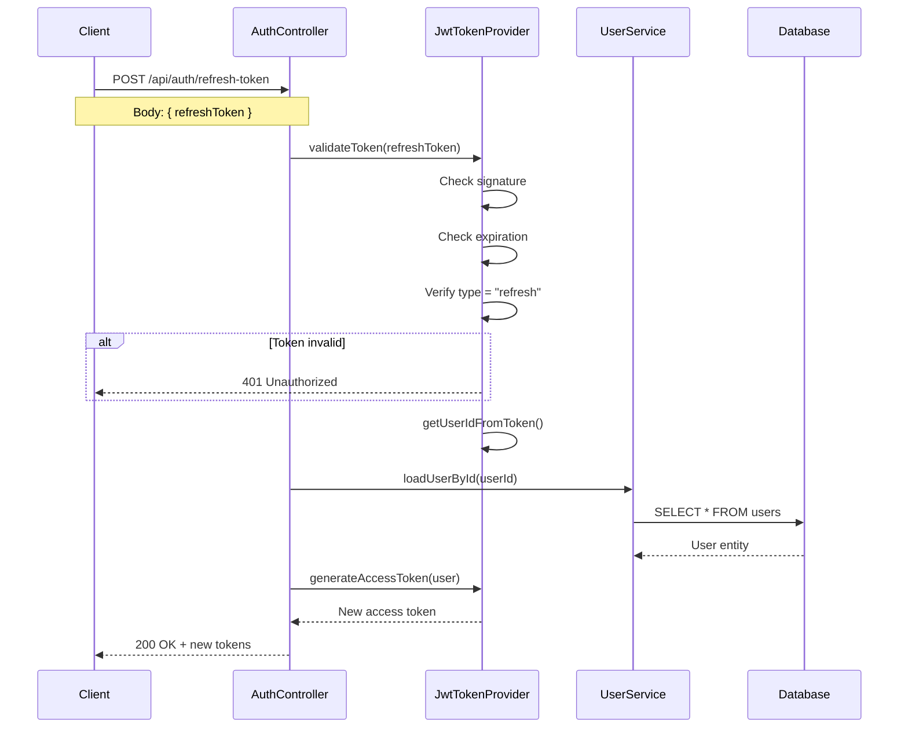
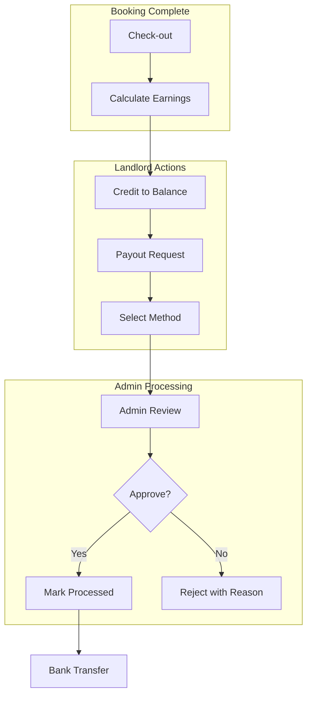

# Data Flow

Understanding how data moves through StayMate for key business operations.

---

## Booking Flow (Most Complex)

The booking process involves multiple domains and state transitions.

---

## Property Listing Flow

---

## Authentication Flow

---

## Token Refresh Flow

---

## Financial Flow

---

## Data Transformation

| Stage | Format |
|-------|--------|
| Request | JSON → DTO |
| Validation | DTO → Validated DTO |
| Mapping | DTO → Entity |
| Persistence | Entity → Database Row |
| Response | Entity → DTO → JSON |
