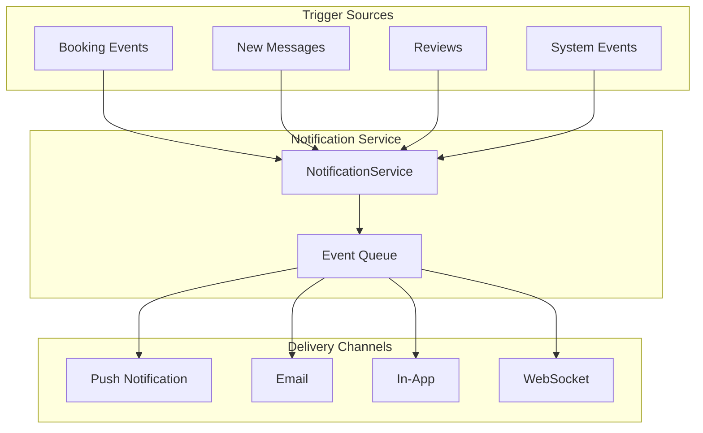
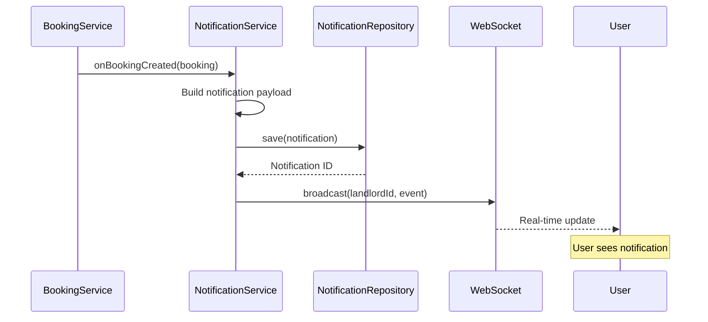
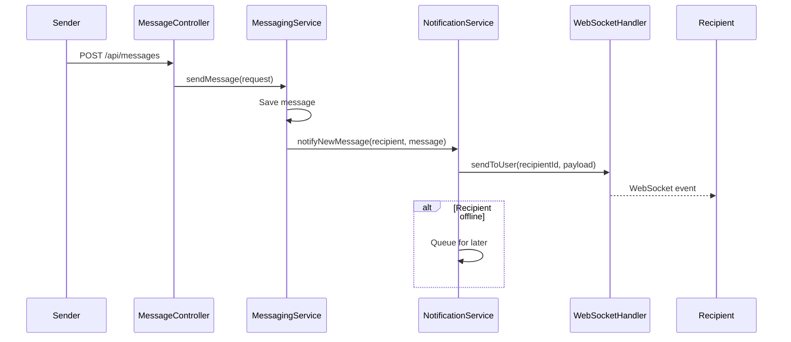
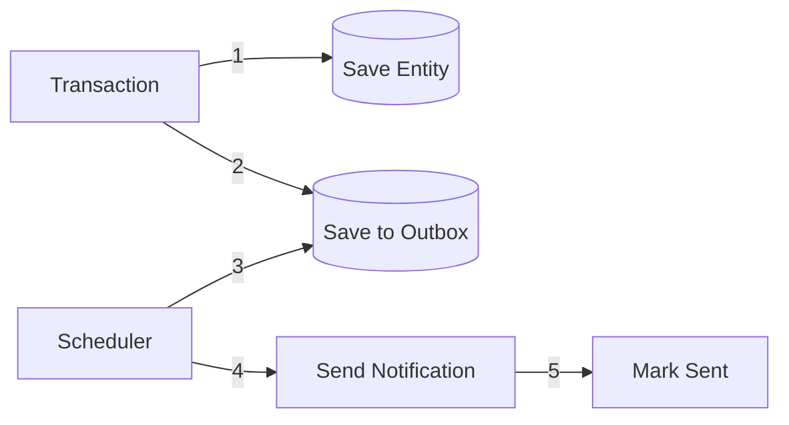

# Event Flow

How notifications and asynchronous events flow through StayMate.

---

## Notification Architecture



---

## Event Types

| Event | Trigger | Recipients | Channels |
|-------|---------|------------|----------|
| `BOOKING_REQUEST` | Tenant creates booking | Landlord | Push, In-App |
| `BOOKING_APPROVED` | Landlord approves | Tenant | Push, In-App, Email |
| `BOOKING_REJECTED` | Landlord rejects | Tenant | Push, In-App |
| `MESSAGE_RECEIVED` | New message | Recipient | Push, In-App |
| `REVIEW_RECEIVED` | New review | Property owner | In-App |
| `PAYOUT_PROCESSED` | Payout completed | Landlord | Push, In-App, Email |

---

## Booking Event Flow



---

## Notification Entity

```java
@Entity
@Table(name = "notifications")
public class Notification {

    @Id
    @GeneratedValue(strategy = GenerationType.IDENTITY)
    private Long id;

    @ManyToOne(fetch = FetchType.LAZY)
    @JoinColumn(name = "user_id")
    private User user;

    @Enumerated(EnumType.STRING)
    private NotificationType type;

    private String title;
    private String message;

    @JdbcTypeCode(SqlTypes.JSON)
    private Map<String, Object> data;

    private boolean read;
    private LocalDateTime createdAt;
}
```

---

## Message Event Flow



---

## WebSocket Configuration

```java
// WebSocketConfig.java
@Configuration
@EnableWebSocketMessageBroker
public class WebSocketConfig implements WebSocketMessageBrokerConfigurer {

    @Override
    public void configureMessageBroker(MessageBrokerRegistry config) {
        config.enableSimpleBroker("/topic", "/queue");
        config.setApplicationDestinationPrefixes("/app");
    }

    @Override
    public void registerStompEndpoints(StompEndpointRegistry registry) {
        registry.addEndpoint("/ws")
                .setAllowedOrigins("*")
                .withSockJS();
    }
}
```

---

## Event Patterns

### Fire and Forget

```java
// Non-blocking notification
@Async
public void sendNotification(Notification notification) {
    notificationRepository.save(notification);
    webSocketService.broadcast(notification);
}
```

### Transactional Outbox (Recommended for Critical Events)



!!! info "Design Note"
    Currently using fire-and-forget. Outbox pattern recommended for payment notifications.
