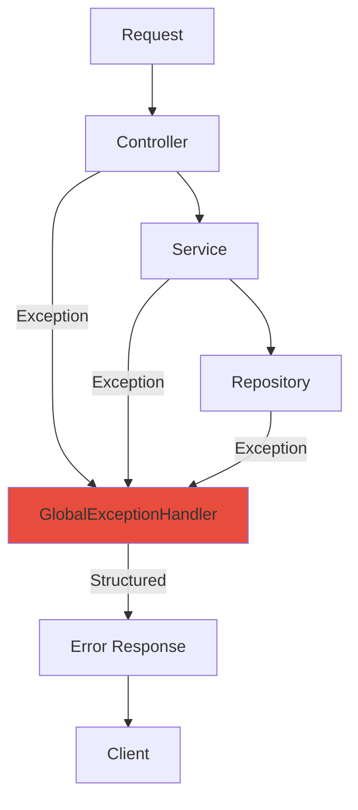
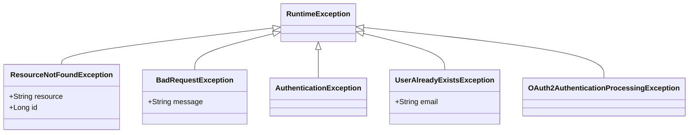

# Failure Handling

How StayMate handles errors, recovers from failures, and maintains system stability.

---

## Error Handling Architecture



---

## GlobalExceptionHandler

Located at `com.webapp.auth.exception.GlobalExceptionHandler`:

```java
@RestControllerAdvice
public class GlobalExceptionHandler {

    @ExceptionHandler(ResourceNotFoundException.class)
    public ResponseEntity<ErrorResponse> handleNotFound(
            ResourceNotFoundException ex, WebRequest request) {
        ErrorResponse error = ErrorResponse.builder()
            .timestamp(LocalDateTime.now())
            .status(HttpStatus.NOT_FOUND.value())
            .error("Not Found")
            .message(ex.getMessage())
            .path(request.getDescription(false))
            .build();
        return ResponseEntity.status(HttpStatus.NOT_FOUND).body(error);
    }

    @ExceptionHandler(BadRequestException.class)
    public ResponseEntity<ErrorResponse> handleBadRequest(...) {...}

    @ExceptionHandler(UserAlreadyExistsException.class)
    public ResponseEntity<ErrorResponse> handleDuplicate(...) {...}

    @ExceptionHandler(MethodArgumentNotValidException.class)
    public ResponseEntity<ValidationErrorResponse> handleValidation(...) {...}

    @ExceptionHandler(AccessDeniedException.class)
    public ResponseEntity<ErrorResponse> handleAccessDenied(...) {...}

    @ExceptionHandler(Exception.class)
    public ResponseEntity<ErrorResponse> handleGlobal(...) {...}
}
```

---

## Exception Hierarchy



---

## Exception to HTTP Mapping

| Exception | HTTP Status | When |
|-----------|-------------|------|
| `ResourceNotFoundException` | 404 | Entity not found |
| `BadRequestException` | 400 | Invalid input |
| `AuthenticationException` | 401 | Auth failure |
| `AccessDeniedException` | 403 | RBAC denial |
| `UserAlreadyExistsException` | 409 | Duplicate user |
| `MethodArgumentNotValidException` | 400 | Validation errors |
| `BadCredentialsException` | 401 | Wrong password |
| `Exception` (fallback) | 500 | Unexpected error |

---

## Error Response Formats

### Standard Error

```json
{
  "timestamp": "2024-01-21T10:00:00Z",
  "status": 404,
  "error": "Not Found",
  "message": "Property not found with id: 999",
  "path": "/api/properties/999"
}
```

### Validation Error

```json
{
  "timestamp": "2024-01-21T10:00:00Z",
  "status": 400,
  "error": "Bad Request",
  "message": "Validation failed",
  "errors": [
    {"field": "email", "message": "must be a valid email"},
    {"field": "password", "message": "must be at least 8 characters"}
  ]
}
```

---

## Resilience Patterns

### Circuit Breaker (Recommended)

!!! info "Future Enhancement"
    For external services (MinIO, email), implement circuit breaker pattern:

    ```java
    @CircuitBreaker(name = "minio", fallbackMethod = "uploadFallback")
    public String uploadFile(MultipartFile file) {
        return minioClient.upload(file);
    }
    ```

### Retry Logic

```java
@Retryable(value = {TransientException.class}, maxAttempts = 3)
public void sendNotification(Notification notification) {
    // Retry up to 3 times on transient failures
}
```

### Graceful Degradation

```java
public List<PropertyResponse> getRecommended(Long userId) {
    try {
        return aiService.getRecommendations(userId);
    } catch (AiServiceException e) {
        log.warn("AI service unavailable, falling back to popular");
        return getPopularProperties();  // Fallback
    }
}
```

---

## Database Failure Handling

### Transaction Rollback

```java
@Transactional
public BookingResponse createBooking(BookingRequest request) {
    Booking booking = bookingRepository.save(entity);

    // If notification fails, booking is NOT rolled back
    notificationService.notify(booking);

    return mapper.toResponse(booking);
}
```

!!! warning "Design Decision"
    Notifications are fire-and-forget. Booking success doesn't depend on notification success.

---

## Logging Failures

```java
@ExceptionHandler(Exception.class)
public ResponseEntity<ErrorResponse> handleGlobal(Exception ex, WebRequest request) {
    log.error("Unexpected error: {}", ex.getMessage(), ex);

    // Don't expose internal details to client
    return ResponseEntity.status(500)
        .body(new ErrorResponse("Internal Server Error"));
}
```
