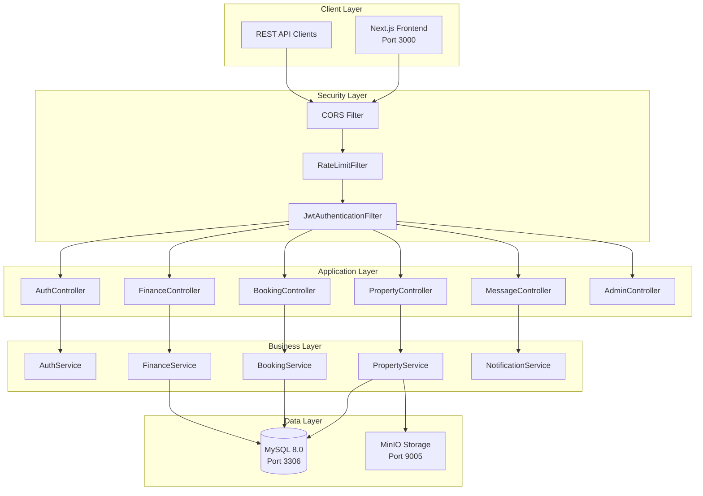

# Architecture

This section provides a deep technical dive into StayMate's architecture, explaining not just **what** we built, but **why** and **how**.

---

## System Overview



---

## Architecture Decisions

| Decision | Choice | Rationale |
|----------|--------|-----------|
| **Framework** | Spring Boot 3.x | Mature, enterprise-ready, great security |
| **Auth** | JWT (stateless) | Horizontal scaling, no session management |
| **Database** | MySQL | ACID compliance, proven at scale |
| **Storage** | MinIO | S3-compatible, self-hosted |
| **Migrations** | Flyway | Version-controlled schema changes |

---

## In This Section

| Document | Description |
|----------|-------------|
| [Clean Architecture](clean-architecture.md) | Layered design and package structure |
| [Service Boundaries](service-boundaries.md) | Domain module organization |
| [Request Lifecycle](request-lifecycle.md) | From HTTP request to response |
| [Data Flow](data-flow.md) | How data moves through the system |
| [Event Flow](event-flow.md) | Notification and messaging patterns |
| [Failure Handling](failure-handling.md) | Error handling and resilience |

---

## Key Components

### Security Chain

| Order | Filter | Package | Purpose |
|-------|--------|---------|---------|
| 1 | `CorsFilter` | Spring | Cross-origin handling |
| 2 | `RateLimitFilter` | `auth.config` | Token bucket throttling |
| 3 | `JwtAuthenticationFilter` | `auth.security` | Token validation |

### Domain Modules

```
com.webapp.domain/
├── admin/          # 28 files - Platform management
├── booking/        # 9 files - Reservation system
├── finance/        # 23 files - Payments & payouts
├── messaging/      # 17 files - Real-time chat
├── property/       # 18 files - Listing management
├── user/           # 18 files - User management
└── ... 17 more domains
```
