# Request Lifecycle

Every HTTP request to StayMate passes through a well-defined processing pipeline.

---

## Complete Request Flow

```mermaid
flowchart TD
    subgraph CLIENT["📱 Client"]
        REQ["HTTP Request"]
    end

    subgraph SECURITY["🔒 Security Layer"]
        CORS["CorsFilter<br/><small>Check allowed origins</small>"]
        RATE["RateLimitFilter<br/><small>Token bucket check</small>"]
        JWT["JwtAuthenticationFilter<br/><small>Validate Bearer token</small>"]
    end

    subgraph APP["⚙️ Application Layer"]
        CTRL["Controller<br/><small>@RestController</small>"]
        VALID["@Valid<br/><small>Bean Validation</small>"]
        AUTH["@PreAuthorize<br/><small>RBAC Check</small>"]
    end

    subgraph BIZ["💼 Business Layer"]
        SVC["Service<br/><small>@Transactional</small>"]
        MAP["Mapper<br/><small>Entity ↔ DTO</small>"]
    end

    subgraph DATA["💾 Data Layer"]
        REPO["Repository<br/><small>Spring Data JPA</small>"]
        DB[("MySQL<br/>Port 3306")]
    end

    REQ --> CORS
    CORS -->|"✅ Origin OK"| RATE
    CORS -->|"❌ Blocked"| REJECT1["403 Forbidden"]

    RATE -->|"✅ Under limit"| JWT
    RATE -->|"❌ Exceeded"| REJECT2["429 Too Many Requests"]

    JWT -->|"✅ Valid token"| CTRL
    JWT -->|"❌ Invalid/Missing"| REJECT3["401 Unauthorized"]

    CTRL --> VALID
    VALID -->|"❌ Invalid"| REJECT4["400 Bad Request"]
    VALID -->|"✅ Valid"| AUTH

    AUTH -->|"❌ No permission"| REJECT5["403 Forbidden"]
    AUTH -->|"✅ Authorized"| SVC

    SVC --> MAP
    MAP --> REPO
    REPO --> DB
    DB --> REPO
    REPO --> MAP
    MAP --> SVC
    SVC --> CTRL
    CTRL --> RESPONSE["HTTP Response"]

    style SECURITY fill:#e74c3c,color:#fff
    style APP fill:#3498db,color:#fff
    style BIZ fill:#2ecc71,color:#fff
    style DATA fill:#9b59b6,color:#fff
```



---

## Detailed Sequence


---

## Filter Chain (Actual Code)

From `SecurityConfig.java`:

```java
// Lines 140-145
.addFilterBefore(rateLimitFilter, UsernamePasswordAuthenticationFilter.class)
.addFilterBefore(jwtAuthenticationFilter, UsernamePasswordAuthenticationFilter.class)
```

!!! note "Filter Order"
    Both filters run **before** `UsernamePasswordAuthenticationFilter`, but the order between them is determined by their `@Order` annotations. RateLimitFilter runs first.

---

## Rate Limit Details

From `RateLimitFilter.java`:


**Client Identification:**
1. Authenticated user: `user:{userId}`
2. Anonymous: `ip:{remoteAddr}` or `ip:{X-Forwarded-For}`

---

## JWT Validation Steps

From `JwtTokenProvider.java`:

```java
public boolean validateToken(String authToken) {
    try {
        Jwts.parser()
            .verifyWith(key)           // 1. Verify signature
            .build()
            .parseSignedClaims(token); // 2. Parse claims
        return true;                   // 3. Check expiration (auto)
    } catch (SignatureException ex) {
        logger.error("Invalid JWT signature");
    } catch (ExpiredJwtException ex) {
        logger.error("Expired JWT token");
    }
    // ... other exceptions
    return false;
}
```

---

## Transaction Boundaries


!!! warning "Notification Caveat"
    If notification save fails, the entire transaction rolls back including the property. Consider async notifications for non-critical cases.
