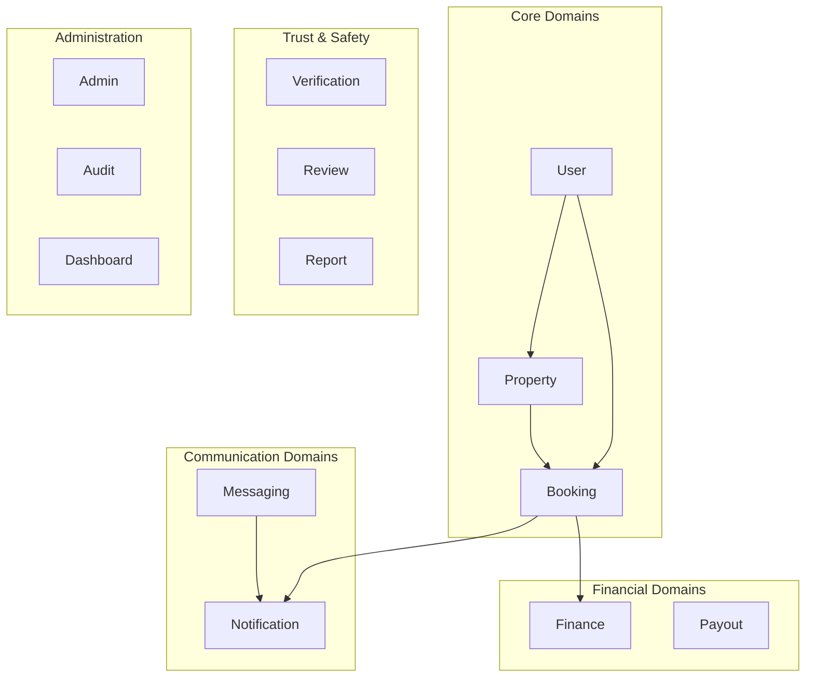
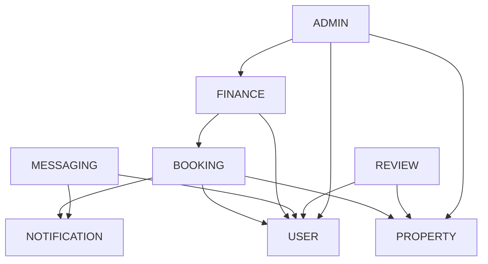

# Service Boundaries

StayMate organizes business logic into **23 domain modules**, each with clear boundaries.

---

## Domain Map



---

## Module Inventory

| Domain | Files | Purpose |
|--------|-------|---------|
| `admin` | 28 | Platform administration, analytics, fraud |
| `ai` | 6 | AI-powered recommendations |
| `application` | 9 | Roommate applications |
| `audit` | 5 | Audit logging |
| `booking` | 9 | Property reservations |
| `contact` | 3 | Contact form handling |
| `dashboard` | 16 | User/landlord/admin dashboards |
| `file` | 4 | File upload/download |
| `finance` | 23 | Earnings, payments, payouts |
| `landlord` | 5 | Landlord-specific features |
| `maintenance` | 6 | Maintenance requests |
| `match` | 8 | User matching |
| `messaging` | 17 | Real-time chat |
| `notification` | 18 | Push/email notifications |
| `property` | 18 | Property listing management |
| `report` | 7 | Reporting system |
| `review` | 7 | User/property reviews |
| `roommate` | 9 | Roommate posts |
| `saved` | 6 | Saved properties/roommates |
| `setting` | 4 | User settings |
| `support` | 12 | Support tickets |
| `user` | 18 | User management |
| `verification` | 8 | Identity verification |

---

## Module Structure

Each domain follows a consistent internal structure:

```
domain/booking/
├── controller/
│   └── BookingController.java
├── dto/
│   ├── BookingRequest.java
│   └── BookingResponse.java
├── entity/
│   └── Booking.java
├── enums/
│   └── BookingStatus.java
├── mapper/
│   └── BookingMapper.java
├── repository/
│   └── BookingRepository.java
└── service/
    ├── BookingService.java
    └── impl/
        └── BookingServiceImpl.java
```

---

## Boundary Rules

!!! danger "Cross-Domain Communication"
    Domains should communicate through **service interfaces**, not direct repository access.

```java
// ✅ Good - Use service interface
@Service
public class BookingServiceImpl {
    private final NotificationService notificationService;

    public void approveBooking(Long id) {
        // ... booking logic
        notificationService.sendBookingApproval(booking);
    }
}

// ❌ Bad - Direct repository access
@Service
public class BookingServiceImpl {
    private final NotificationRepository notificationRepository;  // Don't do this
}
```

---

## Domain Dependencies



---

## Shared Code

Cross-cutting concerns live outside domains:

| Package | Purpose |
|---------|---------|
| `auth.exception` | GlobalExceptionHandler |
| `auth.security` | JWT, OAuth2 |
| `config` | Global configuration |
| `scheduler` | Background jobs |
