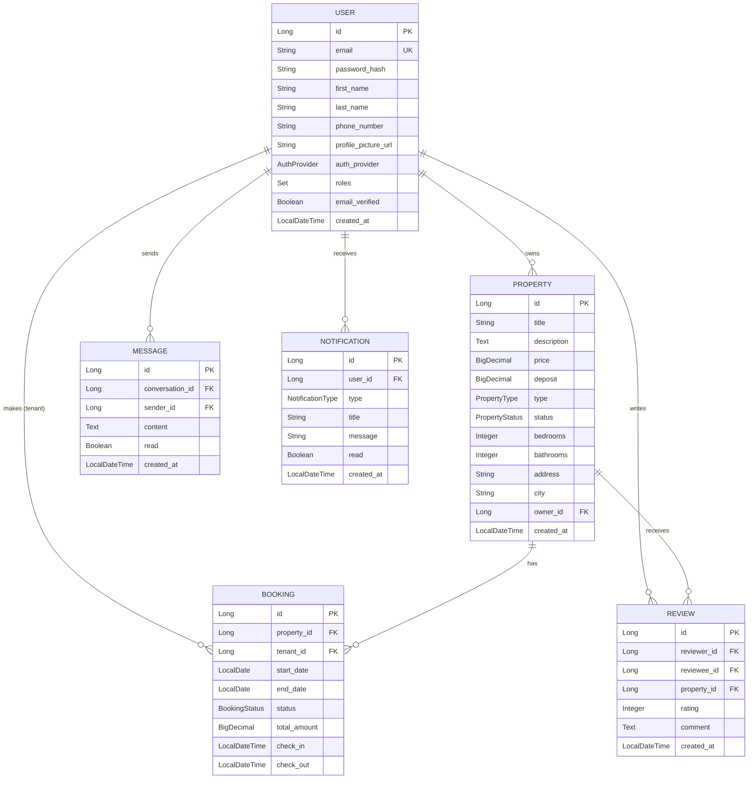

# Entity Relationships

Complete entity relationship diagram for StayMate.

---

## Full ER Diagram

---

## Core Relationships

| Parent | Child | Type | Description |
|--------|-------|------|-------------|
| User | Property | One-to-Many | Landlord owns properties |
| User | Booking | One-to-Many | Tenant makes bookings |
| Property | Booking | One-to-Many | Property has bookings |
| User | Message | One-to-Many | User sends messages |
| User | Notification | One-to-Many | User receives notifications |
| User | Review | One-to-Many | User writes reviews |
