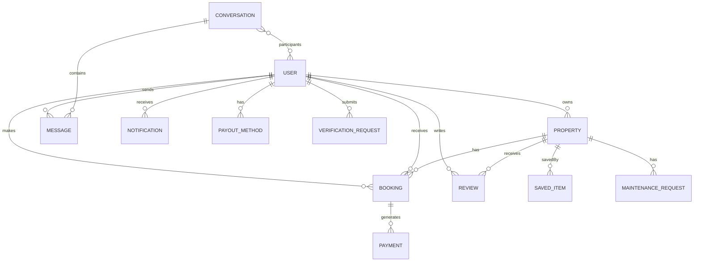

# Database

MySQL database architecture and schema design.

---

## Overview

| Component | Technology |
|-----------|------------|
| Database | MySQL 8.0+ |
| ORM | Hibernate (JPA) |
| Migrations | Flyway |
| Pool | HikariCP |

---

## Entity Relationship Diagram

---

## In This Section

| Document | Description |
|----------|-------------|
| [Schema Design](schema-design.md) | Table structures |
| [Entity Relationships](entity-relationships.md) | ER diagrams |
| [Indexing Strategy](indexing-strategy.md) | Performance indexes |
| [Transactions](transactions.md) | Transaction management |
| [Migrations](migrations.md) | Flyway migrations |

---

## Key Entities

| Entity | Table | Records |
|--------|-------|---------|
| User | `users` | Core identity |
| Property | `properties` | Listings |
| Booking | `bookings` | Reservations |
| Message | `messages` | Chat |
| Notification | `notifications` | Alerts |
