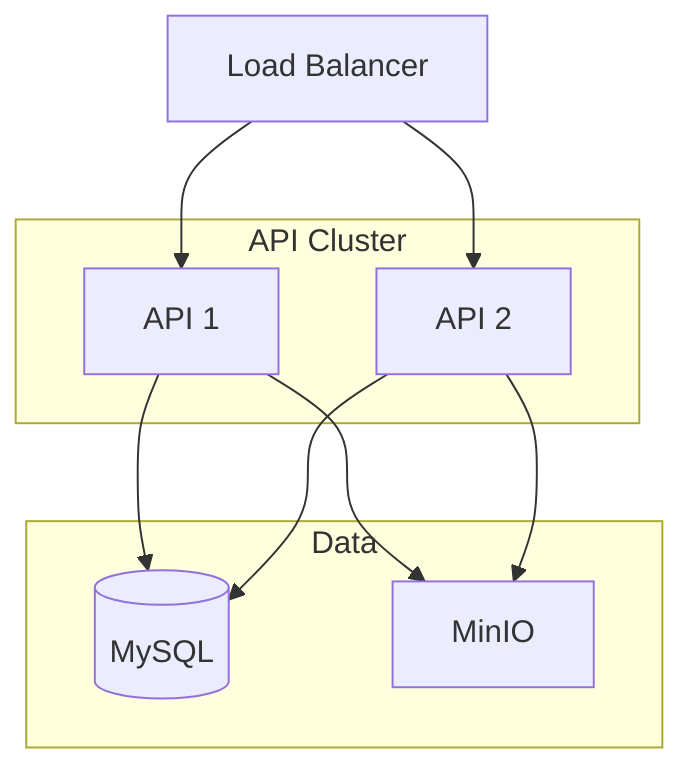

# Deployment Architecture

Production deployment topology.

---

## Architecture

---

## Components

| Component | Purpose |
|-----------|---------|
| Load Balancer | Traffic distribution |
| API Instances | Stateless services |
| MySQL | Primary database |
| MinIO | Object storage |
