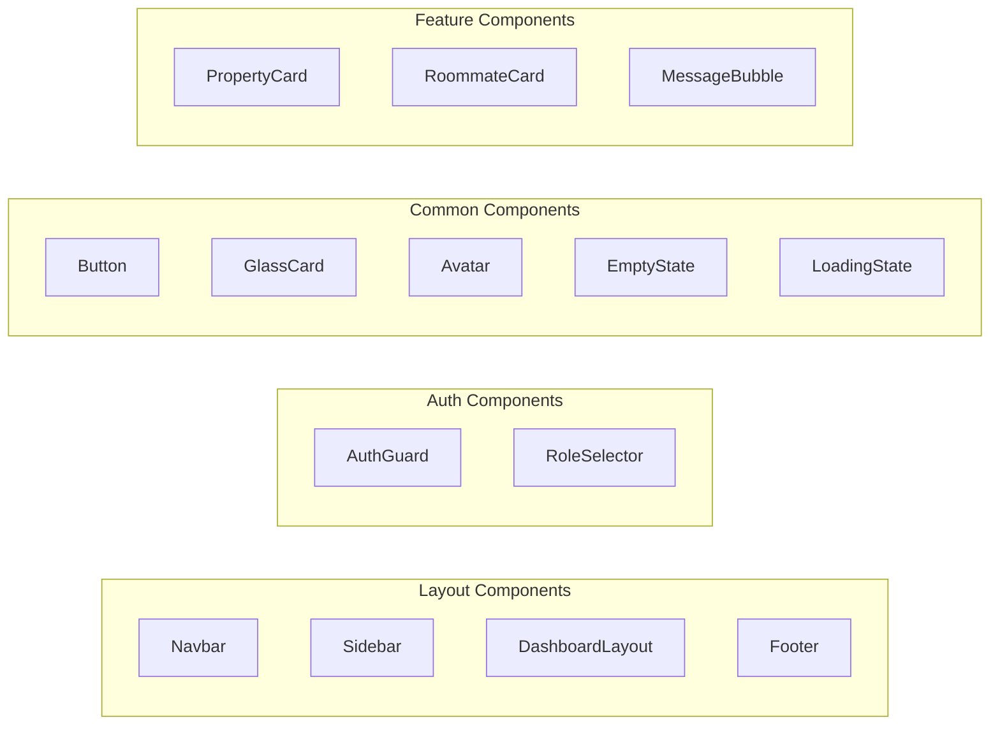

# Components

Reusable React components in StayMate.

---

## Component Categories



---

## Core Components

### Navbar (`components/Navbar.tsx`)

Global navigation with auth-aware rendering:

- Logo and navigation links
- Auth buttons (login/register) or user menu
- Theme toggle
- Mobile responsive

### DashboardLayout (`components/DashboardLayout.tsx`)

Wrapper for authenticated pages:

```tsx
export function DashboardLayout({ children }) {
  return (
    <div className="flex h-screen">
      <Sidebar />
      <main className="flex-1 overflow-auto">
        {children}
      </main>
    </div>
  );
}
```

### AuthGuard (`components/auth/AuthGuard.tsx`)

Route protection:

- Checks authentication state
- Redirects to login if unauthenticated
- Validates role permissions
- Shows loading during auth check

---

## UI Components

| Component | File | Purpose |
|-----------|------|---------|
| `Button` | `Button.tsx` | Styled button variants |
| `GlassCard` | `GlassCard.tsx` | Glass morphism card |
| `Avatar` | `common/Avatar.tsx` | User avatar |
| `EmptyState` | `common/EmptyState.tsx` | No data placeholder |
| `LoadingState` | `common/LoadingState.tsx` | Loading spinner |
| `AnimatedCard` | `common/AnimatedCard.tsx` | Framer Motion card |
| `Map` | `Map.tsx` | Leaflet map |
| `Logo` | `Logo.tsx` | StayMate logo |

---

## Feature Components

### Landing Page

| Component | Purpose |
|-----------|---------|
| `HeroSection` | Main hero with CTA |
| `FeaturesSection` | Feature highlights |
| `TestimonialsCarousel` | User testimonials |
| `FAQSection` | FAQ accordion |
| `AmenitiesSection` | Property amenities |

### Search & Listings

| Component | Purpose |
|-----------|---------|
| `PropertyCard` | Property listing card |
| `RoommateCard` | Roommate listing card |
| `SearchFilters` | Filter controls |
| `SearchResults` | Results grid |

### Admin

| Component | Purpose |
|-----------|---------|
| `UserManagement` | Admin user table |
| `DeletionWarningModal` | Deletion confirmation |
| `AdminStats` | Dashboard statistics |

---

## Component Patterns

### Using Framer Motion

```tsx
import { motion } from 'framer-motion';

export function AnimatedCard({ children }) {
  return (
    <motion.div
      initial={{ opacity: 0, y: 20 }}
      animate={{ opacity: 1, y: 0 }}
      transition={{ duration: 0.3 }}
    >
      {children}
    </motion.div>
  );
}
```

### Using Tailwind + clsx

```tsx
import { clsx } from 'clsx';

export function Button({ variant = 'primary', className, ...props }) {
  return (
    <button
      className={clsx(
        'px-4 py-2 rounded-lg font-medium',
        variant === 'primary' && 'bg-indigo-600 text-white',
        variant === 'secondary' && 'bg-gray-200 text-gray-800',
        className
      )}
      {...props}
    />
  );
}
```
