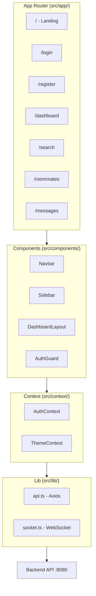

# Frontend

This section documents the Next.js 14 frontend application.

---

## Overview

| Technology | Version | Purpose |
|------------|---------|---------|
| **Next.js** | 14.2.3 | React framework (App Router) |
| **React** | 18.3.1 | UI library |
| **TypeScript** | 5.4.5 | Type safety |
| **Tailwind CSS** | 3.4.3 | Styling |
| **Axios** | 1.6.8 | HTTP client |
| **STOMP.js** | 7.2.1 | WebSocket client |
| **Framer Motion** | 12.23.26 | Animations |
| **Recharts** | 3.6.0 | Data visualization |

---

## Architecture

---

## In This Section

| Document | Description |
|----------|-------------|
| [Project Structure](structure.md) | Directory organization |
| [Pages & Routing](pages.md) | App Router pages |
| [Components](components.md) | Reusable components |
| [State Management](state.md) | Context providers |
| [API Integration](api-client.md) | Axios configuration |
| [WebSocket](websocket.md) | Real-time messaging |
| [Styling](styling.md) | Tailwind configuration |
