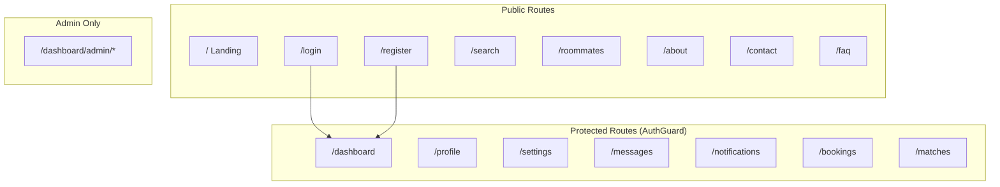

# Pages & Routing

Next.js App Router pages in StayMate.

---

## Route Map



---

## Page Inventory

### Public Pages

| Route | File | Description |
|-------|------|-------------|
| `/` | `app/page.tsx` | Landing page |
| `/login` | `app/login/page.tsx` | Login form |
| `/register` | `app/register/page.tsx` | Registration |
| `/search` | `app/search/page.tsx` | Property search |
| `/roommates` | `app/roommates/page.tsx` | Roommate listings |
| `/about` | `app/about/page.tsx` | About us |
| `/contact` | `app/contact/page.tsx` | Contact form |
| `/faq` | `app/faq/page.tsx` | FAQ |
| `/how-it-works` | `app/how-it-works/page.tsx` | How it works |
| `/testimonials` | `app/testimonials/page.tsx` | User testimonials |

### Protected Pages

| Route | File | Required Role |
|-------|------|---------------|
| `/dashboard` | `app/dashboard/page.tsx` | Any authenticated |
| `/profile` | `app/profile/page.tsx` | Any authenticated |
| `/settings` | `app/settings/page.tsx` | Any authenticated |
| `/messages` | `app/messages/page.tsx` | Any authenticated |
| `/notifications` | `app/notifications/page.tsx` | Any authenticated |
| `/bookings` | `app/bookings/page.tsx` | Any authenticated |
| `/matches` | `app/matches/page.tsx` | Any authenticated |
| `/applications` | `app/applications/page.tsx` | Any authenticated |
| `/verification` | `app/verification/page.tsx` | Any authenticated |

### Role-Based Pages

| Route | Required Role |
|-------|---------------|
| `/select-role` | OAuth users (first login) |
| `/dashboard/admin/*` | ADMIN only |

---

## Route Protection

Using `AuthGuard` component:

```tsx
// components/auth/AuthGuard.tsx
export function AuthGuard({ children, allowedRoles }) {
  const { user, isLoading } = useAuth();
  const router = useRouter();

  useEffect(() => {
    if (!isLoading && !user) {
      router.push('/login');
    }
    if (allowedRoles && !allowedRoles.includes(user?.role)) {
      router.push('/dashboard');
    }
  }, [user, isLoading]);

  if (isLoading) return <LoadingState />;
  return children;
}
```

---

## Dashboard Routing

Role-based dashboard content:

```tsx
// app/dashboard/page.tsx
export default function Dashboard() {
  const { user } = useAuth();

  switch (user?.role) {
    case 'ROLE_ADMIN':
      return <AdminDashboard />;
    case 'ROLE_HOUSE_OWNER':
      return <LandlordDashboard />;
    default:
      return <TenantDashboard />;
  }
}
```
