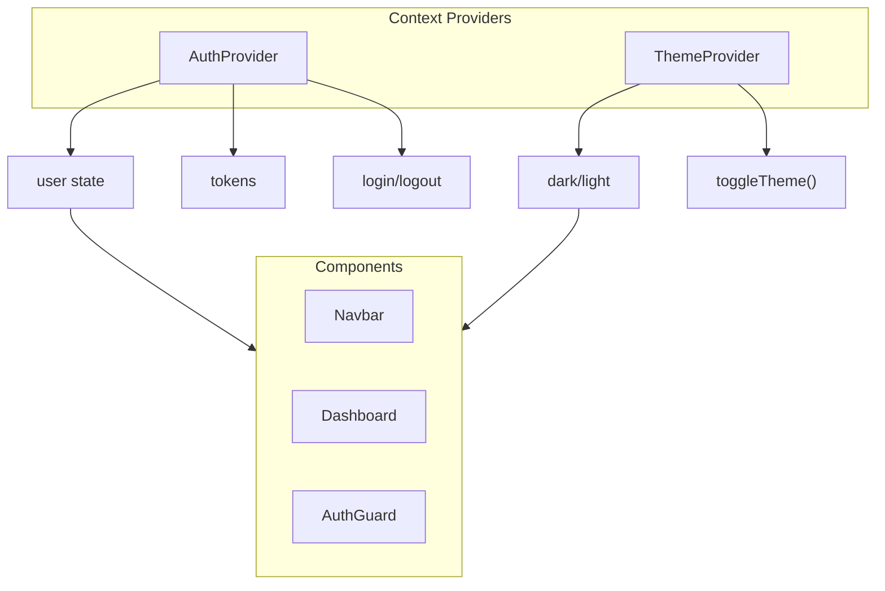

# State Management

React Context providers in StayMate.

---

## Context Architecture



---

## AuthContext

Manages authentication state globally.

### Interface

```typescript
interface AuthContextType {
  user: User | null;
  isLoading: boolean;
  isAuthenticated: boolean;
  login: (email: string, password: string) => Promise<void>;
  register: (data: RegisterData) => Promise<void>;
  logout: () => void;
  refreshToken: () => Promise<void>;
}
```

### Usage

```tsx
// In any component
import { useAuth } from '@/context/AuthContext';

export function ProfileButton() {
  const { user, logout, isLoading } = useAuth();

  if (isLoading) return <Spinner />;
  if (!user) return <LoginButton />;

  return (
    <div>
      <span>{user.firstName}</span>
      <button onClick={logout}>Logout</button>
    </div>
  );
}
```

### Token Management

```typescript
// Tokens stored in localStorage
localStorage.setItem('accessToken', response.accessToken);
localStorage.setItem('refreshToken', response.refreshToken);

// Auto-refresh on 401
api.interceptors.response.use(
  (response) => response,
  async (error) => {
    if (error.response?.status === 401) {
      await refreshToken();
      return api.request(error.config);
    }
    throw error;
  }
);
```

---

## ThemeContext

Manages dark/light mode.

### Interface

```typescript
interface ThemeContextType {
  theme: 'light' | 'dark';
  toggleTheme: () => void;
}
```

### Usage

```tsx
import { useTheme } from '@/context/ThemeContext';

export function ThemeSwitcher() {
  const { theme, toggleTheme } = useTheme();

  return (
    <button onClick={toggleTheme}>
      {theme === 'dark' ? <SunIcon /> : <MoonIcon />}
    </button>
  );
}
```

---

## Provider Setup

In `app/layout.tsx`:

```tsx
export default function RootLayout({ children }) {
  return (
    <html>
      <body>
        <AuthProvider>
          <ThemeProvider>
            {children}
          </ThemeProvider>
        </AuthProvider>
      </body>
    </html>
  );
}
```

!!! tip "Provider Order"
    AuthProvider wraps ThemeProvider because theme preferences might be user-specific in the future.
