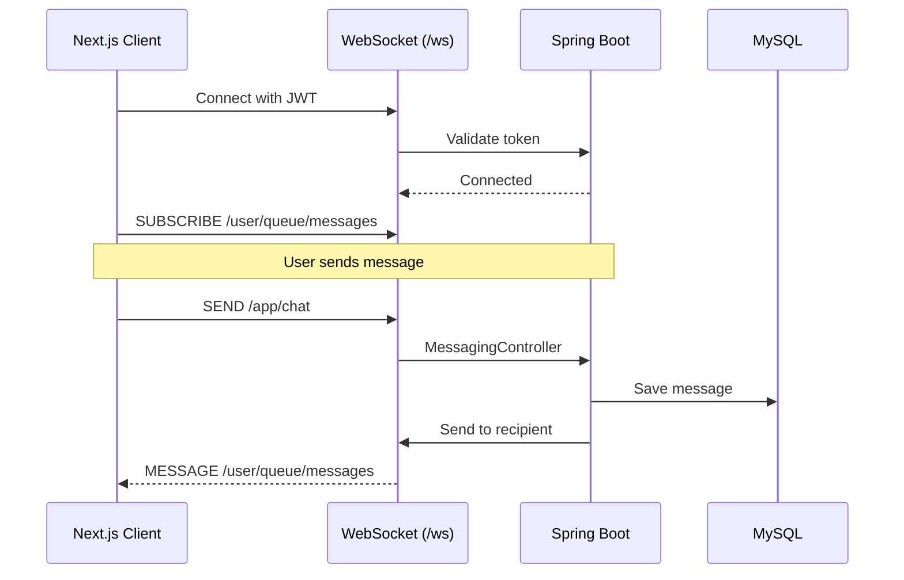
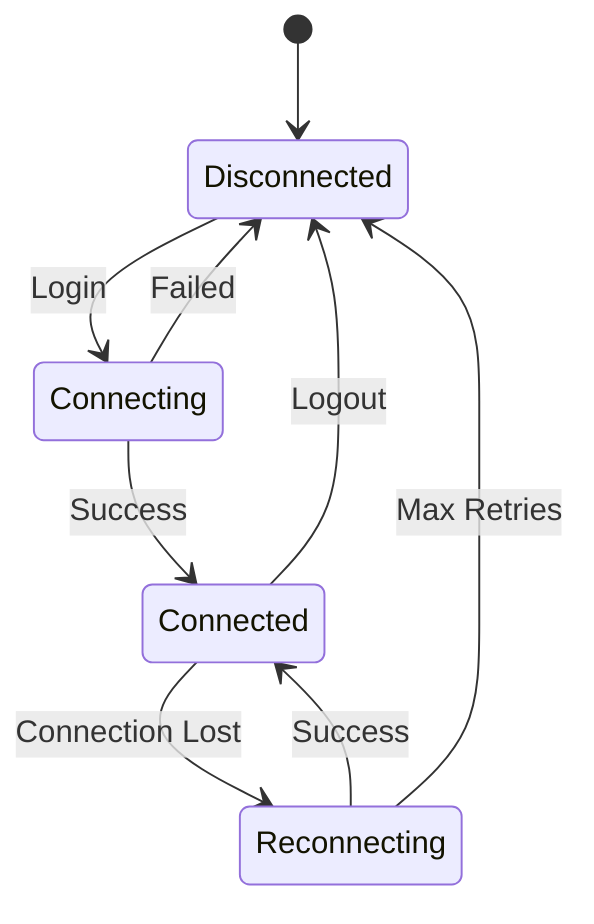

# WebSocket

Real-time messaging with STOMP over WebSocket.

---

## Architecture



---

## Client Setup

Located at `src/lib/socket.ts`:

```typescript
import { Client } from '@stomp/stompjs';
import SockJS from 'sockjs-client';

let stompClient: Client | null = null;

export function connectWebSocket(token: string) {
  stompClient = new Client({
    webSocketFactory: () => new SockJS('http://localhost:8080/ws'),
    connectHeaders: {
      Authorization: `Bearer ${token}`,
    },
    onConnect: () => {
      console.log('WebSocket connected');

      // Subscribe to private messages
      stompClient?.subscribe('/user/queue/messages', (message) => {
        const data = JSON.parse(message.body);
        handleNewMessage(data);
      });

      // Subscribe to notifications
      stompClient?.subscribe('/user/queue/notifications', (notification) => {
        const data = JSON.parse(notification.body);
        handleNotification(data);
      });
    },
    onDisconnect: () => {
      console.log('WebSocket disconnected');
    },
  });

  stompClient.activate();
}

export function sendMessage(conversationId: number, content: string) {
  stompClient?.publish({
    destination: '/app/chat',
    body: JSON.stringify({ conversationId, content }),
  });
}

export function disconnectWebSocket() {
  stompClient?.deactivate();
}
```

---

## Usage in Components

### Messages Page

```tsx
import { connectWebSocket, sendMessage, disconnectWebSocket } from '@/lib/socket';

export function MessagesPage() {
  const { user } = useAuth();
  const [messages, setMessages] = useState([]);

  useEffect(() => {
    const token = localStorage.getItem('accessToken');
    if (token) {
      connectWebSocket(token);
    }

    return () => disconnectWebSocket();
  }, []);

  const handleSend = (content: string) => {
    sendMessage(conversationId, content);
  };

  return (
    <div>
      <MessageList messages={messages} />
      <MessageInput onSend={handleSend} />
    </div>
  );
}
```

---

## Subscriptions

| Destination | Purpose |
|-------------|---------|
| `/user/queue/messages` | Private messages |
| `/user/queue/notifications` | Real-time notifications |

---

## Send Destinations

| Destination | Purpose |
|-------------|---------|
| `/app/chat` | Send message |
| `/app/read` | Mark as read |

---

## Connection Lifecycle



!!! tip "Auto-Reconnect"
    STOMP.js handles automatic reconnection. Configure with `reconnectDelay` option.
