---
hide:
  - navigation
  - toc
---

# StayMate

<div style="text-align: center; padding: 2rem 0;">
<h2 style="font-size: 2.5rem; margin-bottom: 0.5rem;">Enterprise Property Rental Platform</h2>
<p style="font-size: 1.2rem; color: var(--md-default-fg-color--light);">
A production-grade Spring Boot backend for property rental, roommate matching, and financial management
</p>
</div>

---

## :material-rocket-launch: Quick Start

=== "Run Backend"

    ```bash
    cd server
    ./mvnw spring-boot:run
    ```

=== "Run with Docker"

    ```bash
    docker-compose up -d
    ```

=== "Access API"

    ```bash
    curl http://localhost:8080/actuator/health
    ```

---

## :material-chart-box: Platform Overview

```mermaid
graph TB
    subgraph Clients
        WEB["🌐 Next.js Frontend"]
        API["📱 REST API Clients"]
    end

    subgraph "Spring Boot Application"
        GW["🔒 Security Layer"]
        CTRL["🎮 Controllers"]
        SVC["⚙️ Services"]
        REPO["💾 Repositories"]
    end

    subgraph "Data Stores"
        DB[("🗄️ MySQL")]
        MINIO["📦 MinIO"]
    end

    WEB --> GW
    API --> GW
    GW --> CTRL
    CTRL --> SVC
    SVC --> REPO
    REPO --> DB
    SVC --> MINIO

    style GW fill:#e74c3c
    style SVC fill:#3498db
    style DB fill:#27ae60
```



---

## :material-view-grid: Key Features

<div class="grid cards" markdown>

-   :material-shield-lock:{ .lg .middle } **Enterprise Security**

    ---

    JWT + OAuth2 authentication, RBAC authorization, rate limiting, and comprehensive threat mitigation.

    [:octicons-arrow-right-24: Security Docs](security/index.md)

-   :material-home-search:{ .lg .middle } **Property Management**

    ---

    Full CRUD for listings, advanced search, image uploads via MinIO, and moderation workflows.

    [:octicons-arrow-right-24: API Reference](api/index.md)

-   :material-handshake:{ .lg .middle } **Booking System**

    ---

    Complete booking lifecycle: request → approval → check-in → check-out with notifications.

    [:octicons-arrow-right-24: Data Flow](architecture/data-flow.md)

-   :material-cash-multiple:{ .lg .middle } **Financial Operations**

    ---

    Earnings tracking, payout management, payment history, and admin financial oversight.

    [:octicons-arrow-right-24: Backend](backend/index.md)

</div>

---

## :material-archive: Technical Stack

| Layer | Technology | Version |
|-------|------------|---------|
| **Backend** | Spring Boot | 3.x |
| **Language** | Java | 17 LTS |
| **Database** | MySQL | 8.0+ |
| **Migrations** | Flyway | Latest |
| **Auth** | JWT + OAuth2 | jjwt 0.11.x |
| **Storage** | MinIO | S3-compatible |
| **Pool** | HikariCP | Default |

---

## :material-book-open-variant: Documentation Sections

| Section | Description |
|---------|-------------|
| [**Product**](product/index.md) | Motivation, vision, features, and non-goals |
| [**Architecture**](architecture/index.md) | Clean architecture, request lifecycle, data flow |
| [**Security**](security/index.md) | JWT, OAuth2, authorization, threat model |
| [**API Reference**](api/index.md) | Role-aware endpoints (Tenant/Landlord/Admin) |
| [**Backend**](backend/index.md) | Service layer, repositories, DTOs, validation |
| [**Database**](database/index.md) | Schema, ER diagram, indexing, migrations |
| [**Performance**](performance/index.md) | Load testing, caching, scaling |
| [**Observability**](observability/index.md) | Logging, metrics, dashboards |
| [**Quality**](quality/index.md) | Testing strategy, CI/CD |
| [**Deployment**](deployment/index.md) | Docker, configuration, rollback |
| [**Contributing**](oss/index.md) | Code style, branching, roadmap |

---

## :material-scale-balance: Metrics at a Glance

| Metric | Value |
|--------|-------|
| **API Endpoints** | 148 |
| **Domain Modules** | 23 |
| **Flyway Migrations** | 55+ |
| **User Roles** | 3 (USER, HOUSE_OWNER, ADMIN) |
| **SLA Target** | p95 < 500ms |

---

<div style="text-align: center; padding: 2rem 0;">
<p style="color: var(--md-default-fg-color--light);">
Built with ❤️ using Spring Boot, MySQL, and MinIO
</p>
</div>
