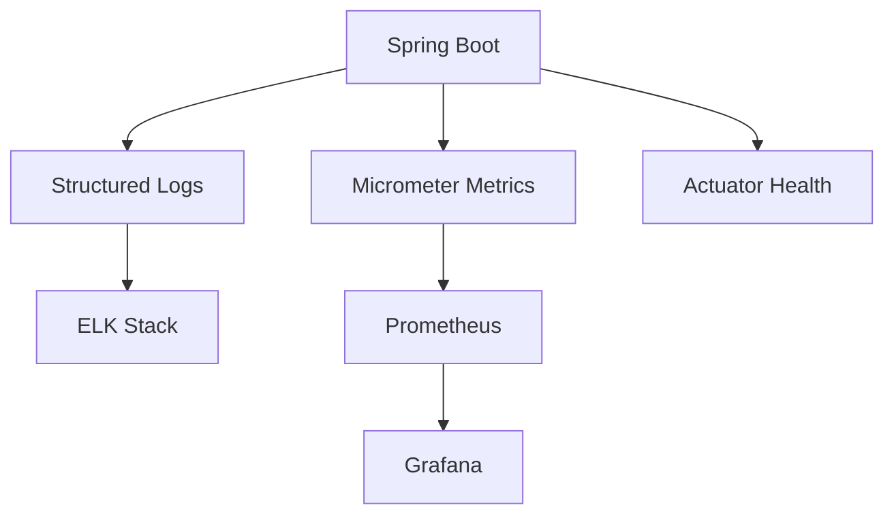

# Observability

Logging, metrics, and monitoring for StayMate.

---

## Observability Stack

---

## In This Section

| Document | Description |
|----------|-------------|
| [Metrics](metrics.md) | Application metrics |
| [Distributed Tracing](distributed-tracing.md) | Request tracing |
| [Alerts](alerts.md) | Alert configuration |
| [Dashboards](dashboards.md) | Grafana dashboards |

---

## Quick Access

| Endpoint | Purpose |
|----------|---------|
| `/actuator/health` | Health check |
| `/actuator/metrics` | Metrics list |
| `/actuator/prometheus` | Prometheus scrape |
