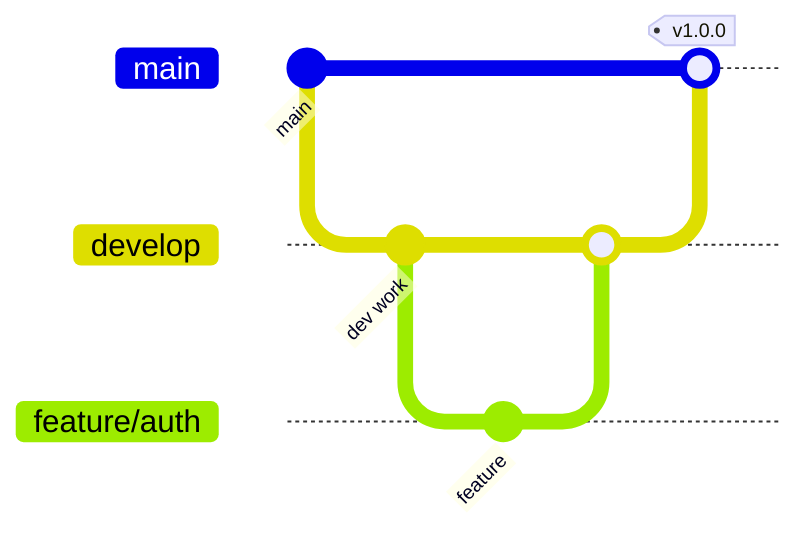

# Branching Strategy

Git branching workflow for StayMate.

---

## Branch Types

---

## Branch Naming

| Type | Pattern | Example |
|------|---------|---------|
| Feature | `feature/description` | `feature/google-oauth` |
| Bugfix | `bugfix/description` | `bugfix/token-expiry` |
| Hotfix | `hotfix/description` | `hotfix/security-patch` |
| Release | `release/version` | `release/1.2.0` |

---

## Workflow

1. Create feature branch from `develop`
2. Implement and test
3. Create Pull Request
4. Code review
5. Merge to `develop`
6. Release: merge `develop` to `main`
