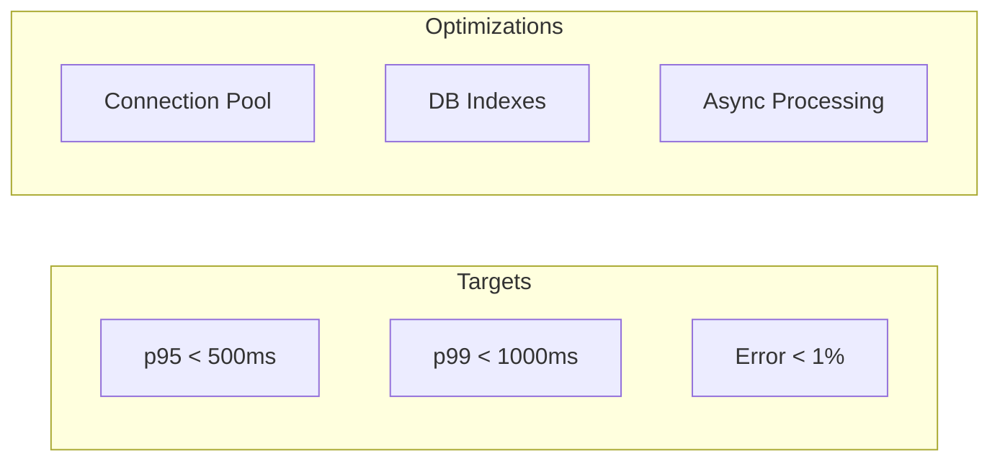

# Performance

Performance optimization and scalability strategies.

---

## Performance Model

---

## In This Section

| Document | Description |
|----------|-------------|
| [Load Testing](load-testing.md) | JMeter & k6 setup |
| [Async Processing](async-processing.md) | Background jobs |
| [Scaling Strategy](scaling-strategy.md) | Horizontal scaling |
| [Bottlenecks](bottlenecks.md) | Identified constraints |

---

## SLA Targets

| Metric | Target | Current |
|--------|--------|---------|
| p95 Response | < 500ms | ✅ |
| p99 Response | < 1000ms | ✅ |
| Error Rate | < 1% | ✅ |
| Throughput | > 100 RPS | ✅ |
