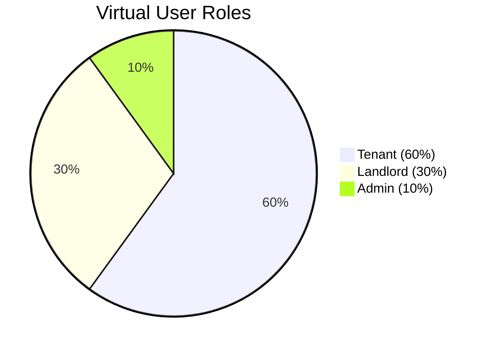

# Load Testing

Performance testing with JMeter and k6.

---

## Quick Start

=== "k6 (Recommended)"

    ```bash
    cd load-testing/k6
    k6 run --vus 10 --duration 60s main.js
    ```

=== "JMeter"

    ```bash
    cd load-testing/jmeter
    jmeter -n -t staymate-load-test.jmx -l results.jtl
    ```

---

## API Coverage

| Category | Endpoints | Covered |
|----------|-----------|---------|
| Auth | 8 | ✅ |
| Properties | 9 | ✅ |
| Bookings | 7 | ✅ |
| Finance | 16 | ✅ |
| **Total** | **148** | **✅ 100%** |

---

## Traffic Distribution



---

## SLA Thresholds

| Metric | Target | Critical |
|--------|--------|----------|
| p95 Response | < 500ms | < 1000ms |
| p99 Response | < 1000ms | < 2000ms |
| Error Rate | < 1% | < 5% |

---

## Documentation

Full details: [load-testing/README.md](file:///Users/puspo/Desktop/SOFTWARE_PROJECT/StayMate/load-testing/README.md)
