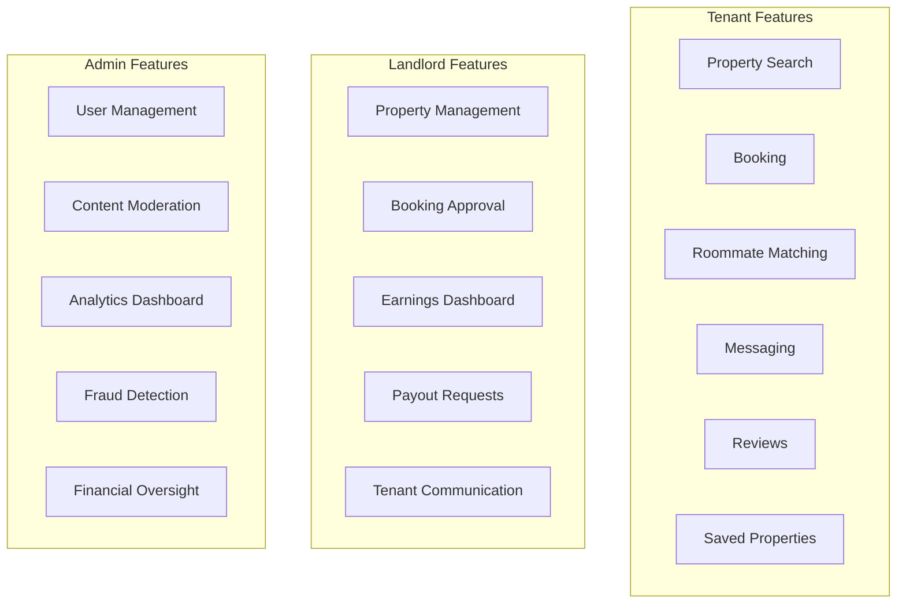
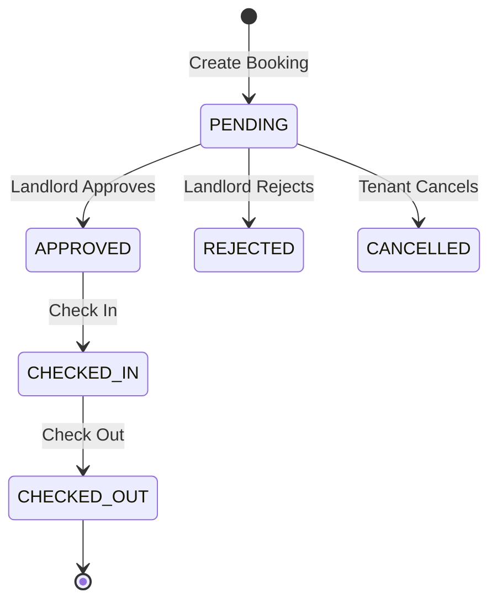
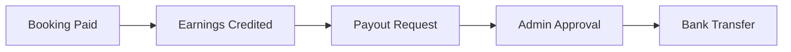

# Features

## Complete Feature Map

StayMate provides role-specific features for Tenants, Landlords, and Administrators.

---

## Feature Overview

---

## Tenant Features

### Property Discovery

| Feature | Description | Endpoint |
|---------|-------------|----------|
| **Search** | Filter by location, price, type, amenities | `GET /api/properties/search` |
| **Recommendations** | AI-powered suggestions | `GET /api/properties/recommended` |
| **Details** | Full property info with images | `GET /api/properties/{id}` |
| **Save** | Bookmark for later | `POST /api/saved/properties` |

### Booking System

### Roommate Matching

- Create roommate posts with preferences
- Search compatible matches
- Direct messaging integration
- Match/unmatch functionality

### Messaging

- Real-time conversations (WebSocket-ready)
- Property-context conversations
- Unread count tracking
- Presence indicators

---

## Landlord Features

### Property Management

| Action | Description |
|--------|-------------|
| **Create** | List new property with images |
| **Update** | Modify details, pricing |
| **Status** | AVAILABLE / UNAVAILABLE / RENTED |
| **Delete** | Remove listing |

### Financial Operations

- Earnings summary and history
- Multiple payout methods
- Export reports (CSV/PDF)

---

## Admin Features

### User Management

- List, search, filter users
- Role management (promote/demote)
- Account actions (suspend, delete)
- Deletion request processing

### Analytics Dashboard

| Metric | Source |
|--------|--------|
| User Growth | `GET /api/admin/analytics/user-growth` |
| Revenue | `GET /api/admin/analytics/revenue` |
| Financial Overview | `GET /api/admin/analytics/financial-overview` |

### Moderation

- Property approval workflow
- Fraud detection and flagging
- Support ticket management
- Verification request processing

---

## Cross-Cutting Features

| Feature | All Roles |
|---------|-----------|
| **Notifications** | Push, in-app, email |
| **Profile** | Update, profile picture |
| **Settings** | Preferences, notifications |
| **Verification** | Phone, document |
