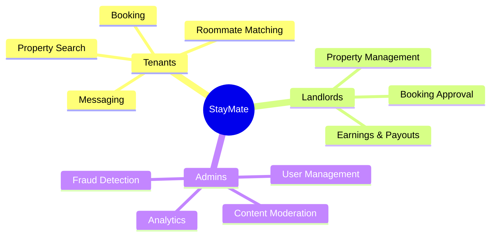

# Product & Vision

This section explains **why** StayMate exists, **what problems** it solves, and **where** it's headed.

---

## Overview

StayMate is a **production-grade property rental platform** built to demonstrate enterprise software engineering practices while solving real-world housing challenges.

---

## In This Section

| Document | Description |
|----------|-------------|
| [Motivation](motivation.md) | Why we built StayMate |
| [Problem Statement](problem-statement.md) | The housing challenges we address |
| [Vision & Goals](vision-and-goals.md) | Where we're headed |
| [Features](features.md) | Complete feature breakdown |
| [Non-Goals](non-goals.md) | What StayMate intentionally doesn't do |

---

## Target Audience

- **Property Seekers (Tenants)**: Finding housing and roommates
- **Property Owners (Landlords)**: Managing listings and tenants
- **Platform Operators (Admins)**: Overseeing the ecosystem
