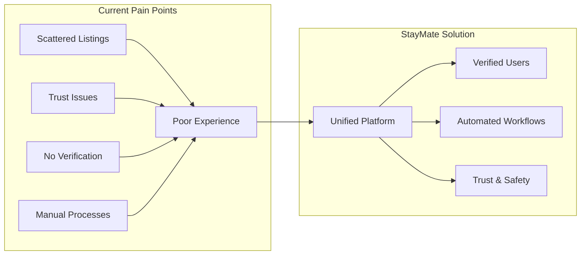

# Motivation

## Why StayMate Exists

StayMate was created to address a dual need:

1. **Real-World Impact**: Solve genuine housing discovery and management challenges
2. **Engineering Excellence**: Demonstrate production-grade software architecture

---

## The Housing Problem

### For Tenants

- Properties scattered across multiple platforms
- No way to verify landlord legitimacy
- Difficulty finding compatible roommates
- Manual booking and payment processes

### For Landlords

- Managing tenant inquiries across channels
- No integrated payment tracking
- Manual verification of tenant backgrounds
- Scattered maintenance request handling

### For Administrators

- No centralized fraud detection
- Manual content moderation
- Limited analytics visibility

---

## Why Spring Boot?

!!! info "Design Decision"
    We chose Spring Boot for its:

    - **Mature Ecosystem**: Battle-tested in enterprise
    - **Security Features**: Spring Security with OAuth2/JWT
    - **Data Access**: Spring Data JPA with Hibernate
    - **Production Readiness**: Actuator, profiles, externalized config

---

## Technical Goals

| Goal | Implementation |
|------|----------------|
| **Security First** | JWT + OAuth2, rate limiting, RBAC |
| **Clean Architecture** | Layered design with clear boundaries |
| **Observability** | Structured logging, metrics, health checks |
| **Scalability** | Stateless auth, connection pooling |
| **Maintainability** | DTO patterns, exception handling, migrations |

---

## Who Should Use This?

- **Developers** learning enterprise Spring Boot patterns
- **Architects** evaluating production-ready designs
- **Interviewers** assessing real-world project experience
- **Contributors** interested in OSS property tech
