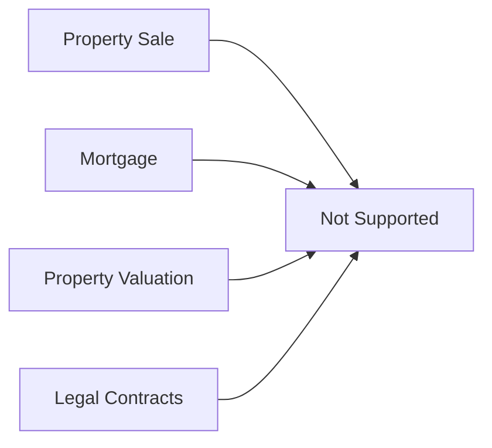

# Non-Goals

## What StayMate Doesn't Do

Being clear about non-goals prevents scope creep and focuses development effort.

---

## Explicit Non-Goals

### 1. Payment Processing

!!! warning "Not a Payment Gateway"
    StayMate **tracks** financial transactions but does not **process** payments.

    - We record earnings and payouts
    - Actual money movement is external (bank transfers, Stripe integration is future scope)
    - No credit card storage or PCI compliance

### 2. Real Estate Transactions

StayMate is for **rentals only**:

- No property buying/selling
- No mortgage calculations
- No legal contract generation
- No escrow services

### 3. Background Checks

| Feature | Status | Reason |
|---------|--------|--------|
| Credit checks | ❌ | Requires third-party integrations |
| Criminal records | ❌ | Legal and privacy complexity |
| Employment verification | ❌ | Out of scope |
| Reference checks | ❌ | Manual process recommended |

### 4. Property Maintenance Automation

We provide:

- ✅ Maintenance request submission
- ✅ Request status tracking
- ✅ Communication between tenant and landlord

We do not provide:

- ❌ Contractor dispatch
- ❌ Parts ordering
- ❌ Scheduling integration
- ❌ IoT device integration

### 5. Multi-Tenancy (SaaS Model)

!!! info "Single Tenant Architecture"
    Current design is single-tenant:

    - One database for all users
    - No customer isolation
    - No white-labeling

### 6. Offline Functionality

- API requires internet connection
- No Progressive Web App (PWA) features
- No offline data sync

---

## Why These Non-Goals?

| Non-Goal | Rationale |
|----------|-----------|
| Payment processing | Regulatory complexity, security burden |
| Real estate sales | Different market, different features |
| Background checks | Privacy concerns, third-party dependency |
| Contractor dispatch | Requires marketplace functionality |
| Multi-tenancy | Adds significant complexity |

---

## Future Considerations

These may become goals in future versions:

1. **Stripe Integration** for in-app payments
2. **Background Check API** integration
3. **Mobile App** for offline-first experience
4. **Multi-tenancy** for enterprise customers

!!! tip "Contributing"
    If you'd like to work on any of these, see [Contributing](../oss/contributing.md).
