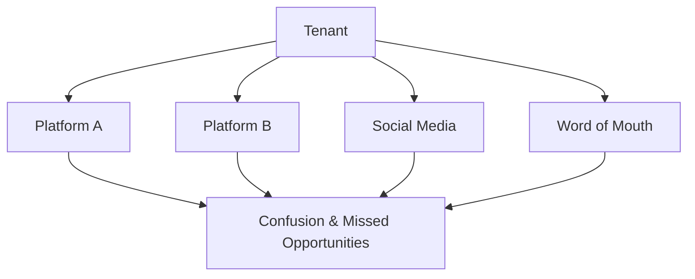
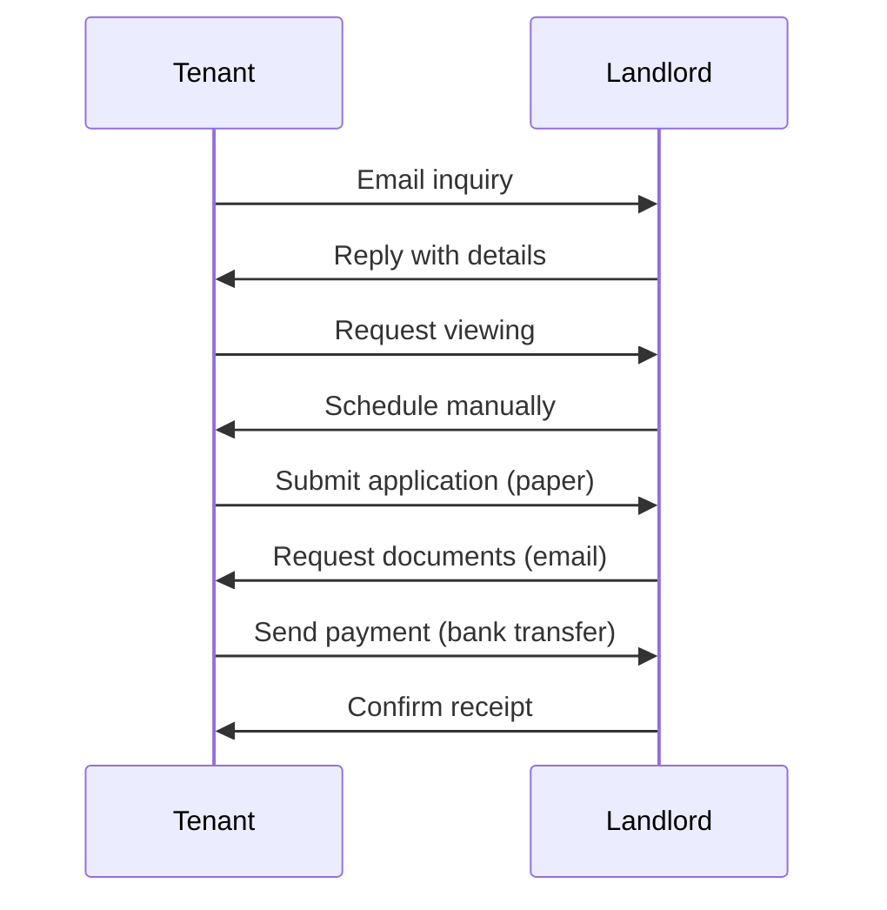

# Problem Statement

## The Housing Discovery Challenge

Finding and managing rental properties involves multiple disconnected systems, manual processes, and trust gaps.

---

## Core Problems

### 1. Fragmented Discovery

**Impact**: Tenants waste hours searching across platforms; landlords miss potential tenants.

### 2. Trust Deficit

| Stakeholder | Trust Problem |
|-------------|---------------|
| Tenant | Is this landlord legitimate? Is the property real? |
| Landlord | Will this tenant pay? Are they who they claim? |
| Both | Is this platform secure? |

**Impact**: Scams, disputes, and abandoned bookings.

### 3. Manual Workflows

**Impact**: Slow turnaround, lost communications, no audit trail.

### 4. Roommate Matching Gap

- No integrated solution for finding compatible roommates
- Separate apps for housing vs. roommate search
- No unified messaging

---

## StayMate's Solution

| Problem | Solution |
|---------|----------|
| Fragmented discovery | Unified search with filters |
| Trust deficit | Verification system, reviews |
| Manual workflows | Automated booking lifecycle |
| Roommate gap | Integrated matching + messaging |

---

## Success Criteria

!!! success "We've succeeded when:"
    - A tenant can go from search → booking in under 10 minutes
    - Landlords manage all properties from a single dashboard
    - Admins can detect fraud before it impacts users
    - The platform achieves p95 response time < 500ms
