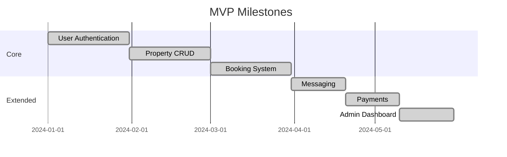
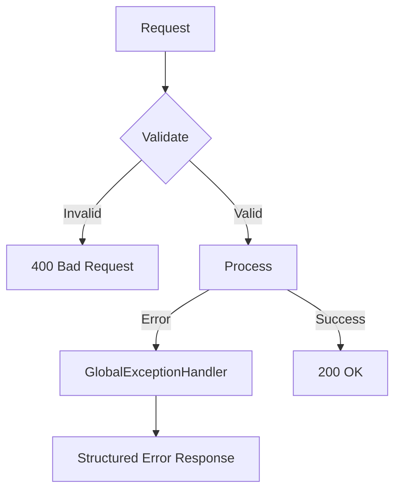

# Vision & Goals

## Vision Statement

> **StayMate will be the most trusted and efficient platform for property rental and roommate matching, where every interaction is secure, every workflow is automated, and every user experience is delightful.**

---

## Strategic Goals

### Short-Term (MVP)



### Medium-Term

- [ ] AI-powered property recommendations
- [ ] Advanced roommate matching algorithms
- [ ] Mobile application (React Native)
- [ ] Multi-currency support

### Long-Term

- [ ] International expansion
- [ ] Blockchain-based rental agreements
- [ ] IoT integration for smart properties

---

## Design Principles

### 1. Security First

Every feature is designed with security as a foundation:

```java
// Example: All endpoints protected by default
.anyRequest().authenticated()
```

### 2. Fail Fast, Recover Gracefully



### 3. Observable by Default

- Structured JSON logging
- Health endpoints exposed
- Metrics-ready architecture

### 4. Developer Experience

- Consistent API contracts
- Comprehensive error messages
- Self-documenting code

---

## Quality Attributes

| Attribute | Target | How |
|-----------|--------|-----|
| **Performance** | p95 < 500ms | Connection pooling, efficient queries |
| **Availability** | 99.9% | Health checks, graceful degradation |
| **Security** | Zero breaches | JWT, rate limiting, input validation |
| **Maintainability** | < 1 hour to understand any module | Clean architecture, documentation |

---

## North Star Metrics

- **Time to First Booking**: < 10 minutes for new users
- **Landlord Listing Time**: < 5 minutes per property
- **API Response Time**: p95 < 500ms
- **Error Rate**: < 0.1%
