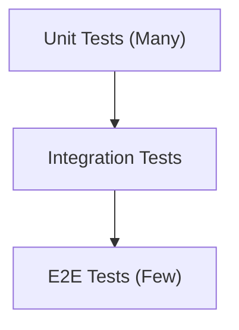

# Quality & Delivery

Testing strategy and CI/CD pipeline.

---

## Testing Pyramid

---

## In This Section

| Document | Description |
|----------|-------------|
| [Unit Testing](unit-testing.md) | JUnit & Mockito |
| [Integration Testing](integration-testing.md) | Spring Boot Test |
| [Contract Testing](contract-testing.md) | API contracts |
| [CI/CD](ci-cd.md) | Pipeline configuration |
| [Release Strategy](release-strategy.md) | Versioning & releases |

---

## Coverage Targets

| Layer | Target |
|-------|--------|
| Services | 80%+ |
| Controllers | 70%+ |
| Repositories | 60%+ |
