# Authorization Model

Role-Based Access Control (RBAC) implementation in StayMate.

---

## Role Hierarchy

```mermaid
graph TD
    ADMIN["🔐 ADMIN<br/>Full Platform Access"]
    HOUSE_OWNER["🏠 HOUSE_OWNER<br/>Property Management"]
    USER["👤 USER<br/>Basic Access"]

    ADMIN --> HOUSE_OWNER
    HOUSE_OWNER --> USER

    style ADMIN fill:#e74c3c
    style HOUSE_OWNER fill:#3498db
    style USER fill:#2ecc71
```



---

## Role Definitions

| Role | Code | Description |
|------|------|-------------|
| **USER** | `ROLE_USER` | Tenants searching and booking properties |
| **HOUSE_OWNER** | `ROLE_HOUSE_OWNER` | Landlords managing properties |
| **ADMIN** | `ROLE_ADMIN` | Platform administrators |

---

## Role Capabilities Matrix

| Capability | USER | HOUSE_OWNER | ADMIN |
|------------|:----:|:-----------:|:-----:|
| View properties | ✅ | ✅ | ✅ |
| Create bookings | ✅ | ✅ | ✅ |
| Create properties | ❌ | ✅ | ✅ |
| Approve bookings | ❌ | ✅ | ✅ |
| View earnings | ❌ | ✅ | ✅ |
| Request payouts | ❌ | ✅ | ✅ |
| Manage users | ❌ | ❌ | ✅ |
| View analytics | ❌ | ❌ | ✅ |
| Process payouts | ❌ | ❌ | ✅ |
| Fraud detection | ❌ | ❌ | ✅ |

---

## Implementation

### SecurityConfig Authorization Rules

```java
// SecurityConfig.java
@Bean
public SecurityFilterChain securityFilterChain(HttpSecurity http) {
    http.authorizeHttpRequests(auth -> auth
        // Public endpoints
        .requestMatchers(
            "/api/auth/register",
            "/api/auth/login",
            "/api/auth/refresh-token",
            "/api/public/**"
        ).permitAll()

        // Admin only
        .requestMatchers("/api/admin/**")
            .hasRole("ADMIN")

        // House owner endpoints
        .requestMatchers("/api/house-owner/**")
            .hasAnyRole("HOUSE_OWNER", "ADMIN")

        // Authenticated users
        .requestMatchers("/api/users/**")
            .authenticated()

        // Default: require authentication
        .anyRequest().authenticated()
    );
    return http.build();
}
```

### Method-Level Security

```java
@RestController
@RequestMapping("/api/properties")
public class PropertyController {

    @PostMapping
    @PreAuthorize("hasRole('HOUSE_OWNER')")
    public ResponseEntity<PropertyResponse> create(...) {
        // Only HOUSE_OWNER and ADMIN
    }

    @DeleteMapping("/{id}")
    @PreAuthorize("hasRole('ADMIN') or @propertyService.isOwner(#id)")
    public ResponseEntity<Void> delete(@PathVariable Long id) {
        // Admin OR property owner
    }
}
```

---

## User Entity Roles

```java
// User.java
@Entity
public class User {

    @ElementCollection(fetch = FetchType.EAGER)
    @CollectionTable(name = "user_roles", joinColumns = @JoinColumn(name = "user_id"))
    @Enumerated(EnumType.STRING)
    @Column(name = "role")
    private Set<RoleName> roles = new HashSet<>();

    public boolean isAdmin() {
        return roles.contains(RoleName.ROLE_ADMIN);
    }

    public boolean isHouseOwner() {
        return roles.contains(RoleName.ROLE_HOUSE_OWNER);
    }
}
```

```java
// RoleName.java
public enum RoleName {
    ROLE_USER,
    ROLE_HOUSE_OWNER,
    ROLE_ADMIN
}
```

---

## Role Assignment Flow


---

## OAuth2 Role Selection

For OAuth2 users, role selection happens after first login:

```java
@PostMapping("/select-role")
@PreAuthorize("isAuthenticated()")
public ResponseEntity<AuthResponse> selectRole(
        @RequestBody RoleSelectionRequest request) {

    User user = userService.getCurrentUser();

    if (user.isRoleSelected()) {
        throw new BadRequestException("Role already selected");
    }

    user.getRoles().add(request.getRole());
    user.setRoleSelected(true);
    userRepository.save(user);

    // Generate new tokens with updated roles
    return ResponseEntity.ok(authService.generateTokens(user));
}
```

---

## Endpoint Protection Summary

| Pattern | Access |
|---------|--------|
| `/api/auth/register,login,refresh-token` | Public |
| `/api/public/**` | Public |
| `/api/admin/**` | ADMIN only |
| `/api/house-owner/**` | HOUSE_OWNER, ADMIN |
| `/api/**` (others) | Authenticated |
