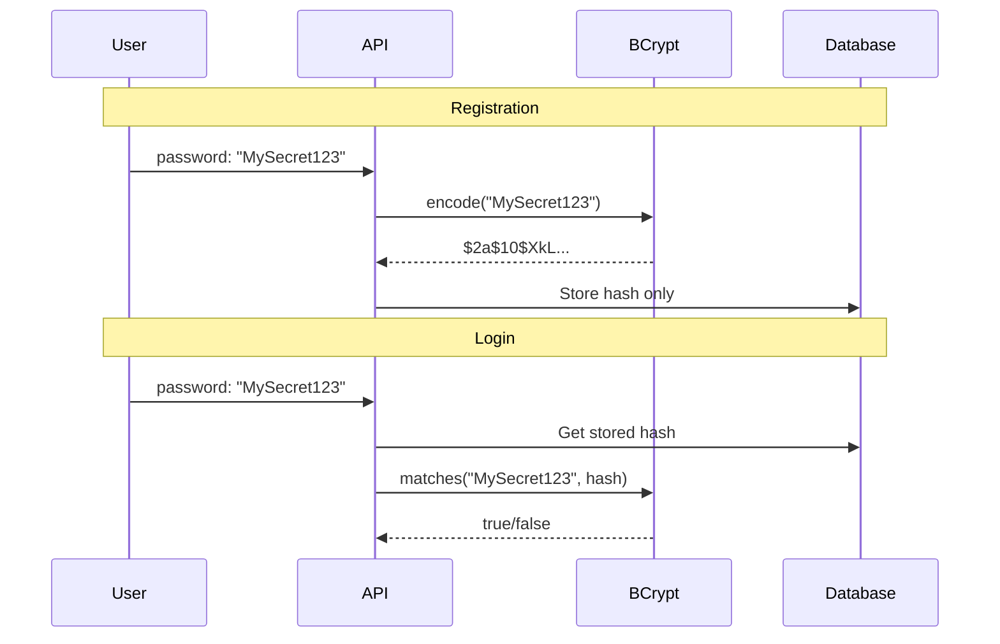
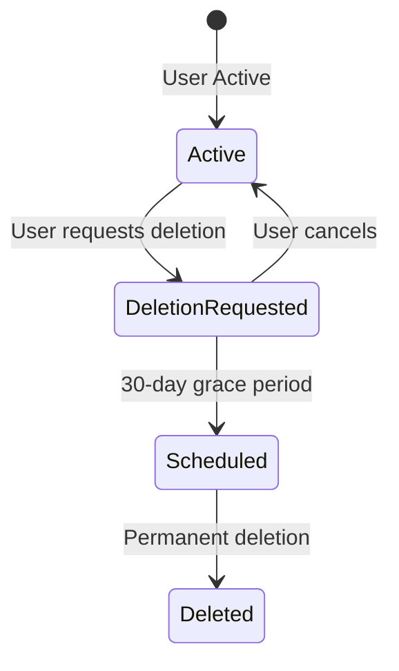

# Data Privacy

How StayMate protects user data and handles sensitive information.

---

## Data Classification

| Category | Examples | Protection |
|----------|----------|------------|
| **Credentials** | Passwords, tokens | BCrypt, never logged |
| **PII** | Email, phone, address | Encrypted at rest |
| **Financial** | Earnings, payouts | Access controlled |
| **Content** | Messages, reviews | User-owned |

---

## Password Security

### Hashing Strategy

```java
@Bean
public PasswordEncoder passwordEncoder() {
    return new BCryptPasswordEncoder(10);
}
```

| Algorithm | BCrypt |
|-----------|--------|
| Strength | 10 (2^10 iterations) |
| Salt | Auto-generated |
| Reversible | No |

### Password Flow



### Password Rules

```java
public class RegisterRequest {
    @NotBlank
    @Size(min = 8, message = "Password must be at least 8 characters")
    @Pattern(regexp = ".*[A-Z].*", message = "Must contain uppercase")
    @Pattern(regexp = ".*[a-z].*", message = "Must contain lowercase")
    @Pattern(regexp = ".*[0-9].*", message = "Must contain digit")
    private String password;
}
```

---

## Sensitive Data Handling

### Never Log Sensitive Data

```java
// ❌ NEVER do this
log.info("User login: email={}, password={}", email, password);
log.debug("Token generated: {}", jwtToken);

// ✅ Do this instead
log.info("User login attempt: email={}", email);
log.debug("Token generated for userId={}", userId);
```

### DTO Pattern for Response Filtering

```java
// Entity contains sensitive data
@Entity
public class User {
    private Long id;
    private String email;
    private String password;  // BCrypt hash - NEVER expose
    private String phoneOtp;   // OTP - NEVER expose
}

// Response DTO excludes sensitive fields
public class UserResponse {
    private Long id;
    private String email;
    private String firstName;
    private String lastName;
    // No password, no OTP
}
```

---

## Access Control for Financial Data

```java
@GetMapping("/earnings")
@PreAuthorize("hasRole('HOUSE_OWNER')")
public ResponseEntity<EarningsResponse> getEarnings() {
    User user = userService.getCurrentUser();
    // Only returns current user's earnings
    return ResponseEntity.ok(financeService.getEarnings(user.getId()));
}
```

---

## Data Retention

### User Deletion Flow



```java
// User.java
@Column(name = "deletion_requested_at")
private LocalDateTime deletionRequestedAt;

@Column(name = "deletion_scheduled_at")
private LocalDateTime deletionScheduledAt;

@Column(name = "account_status")
@Enumerated(EnumType.STRING)
private AccountStatus accountStatus;  // ACTIVE, DELETION_PENDING, DELETED
```

---

## Database Security

### Connection Security

```properties
# Use SSL in production
spring.datasource.url=jdbc:mysql://host:3306/db?useSSL=true
```

### Encryption at Rest

!!! info "Recommendation"
    Enable MySQL encryption at rest for production:

    ```sql
    ALTER TABLE users ENCRYPTION='Y';
    ```

---

## API Security Headers

```java
// SecurityConfig.java
.headers(headers -> headers
    .frameOptions(frame -> frame.sameOrigin())
    .contentSecurityPolicy(csp -> csp
        .policyDirectives("default-src 'self'"))
)
```

---

## Compliance Considerations

| Regulation | Relevance | Implementation |
|------------|-----------|----------------|
| GDPR | EU users | Data deletion, export |
| CCPA | California | Opt-out mechanisms |
| PCI-DSS | Payments | Not processing cards (out of scope) |

!!! warning "Legal Note"
    This is a technical guide. Consult legal counsel for compliance requirements.
