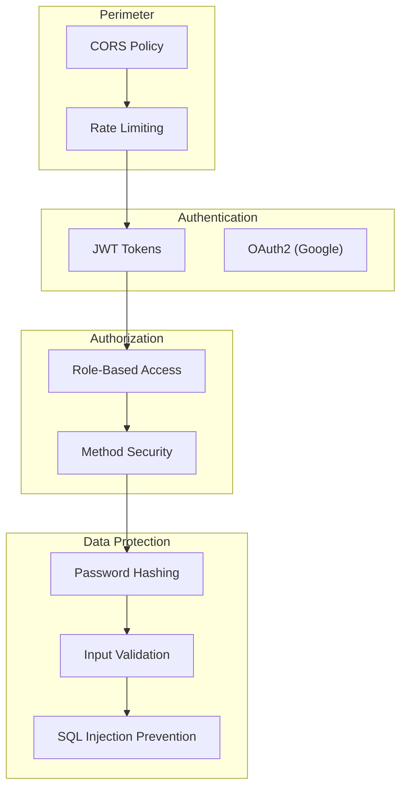

# Security

This section covers StayMate's comprehensive security architecture, from authentication to threat mitigation.

---

## Security Layers

---

## Security Stack

| Layer | Technology | Configuration |
|-------|------------|---------------|
| **Authentication** | JWT + OAuth2 | `JwtTokenProvider`, `CustomOAuth2UserService` |
| **Authorization** | Spring Security | `@PreAuthorize`, `SecurityConfig` |
| **Rate Limiting** | Token Bucket | `RateLimitFilter` |
| **Password** | BCrypt | `PasswordEncoder` |
| **CORS** | Spring CORS | `CorsConfigurationSource` |

---

## In This Section

| Document | Description |
|----------|-------------|
| [JWT Lifecycle](jwt-lifecycle.md) | Token generation, validation, refresh |
| [Authorization Model](authorization-model.md) | RBAC with roles and permissions |
| [Threat Model](threat-model.md) | Security threats and mitigations |
| [Rate Limiting](rate-limiting.md) | Token bucket algorithm, configuration |
| [Data Privacy](data-privacy.md) | Password handling, data protection |

---

## Key Security Classes

| Class | Package | Purpose |
|-------|---------|---------|
| `SecurityConfig` | `auth.config` | HTTP security filter chain |
| `JwtTokenProvider` | `auth.security` | Token generation/validation |
| `JwtAuthenticationFilter` | `auth.security` | Request authentication |
| `RateLimitFilter` | `auth.config` | Request throttling |
| `CustomOAuth2UserService` | `auth.security.oauth2` | Google OAuth2 |
| `GlobalExceptionHandler` | `auth.exception` | Security error handling |

---

## Quick Security Facts

- **Token Types**: Access (15 min), Refresh (7 days)
- **Roles**: `USER`, `HOUSE_OWNER`, `ADMIN`
- **OAuth Providers**: Google
- **Rate Limit**: 200 requests/minute default
- **Password**: BCrypt with strength 10
