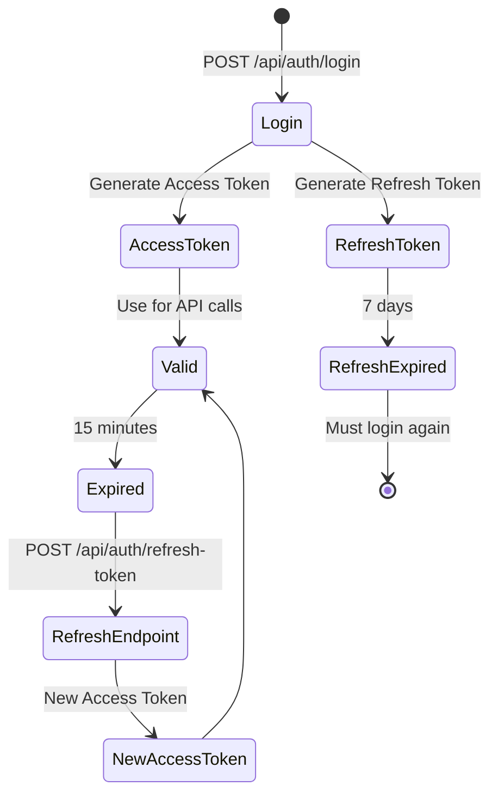
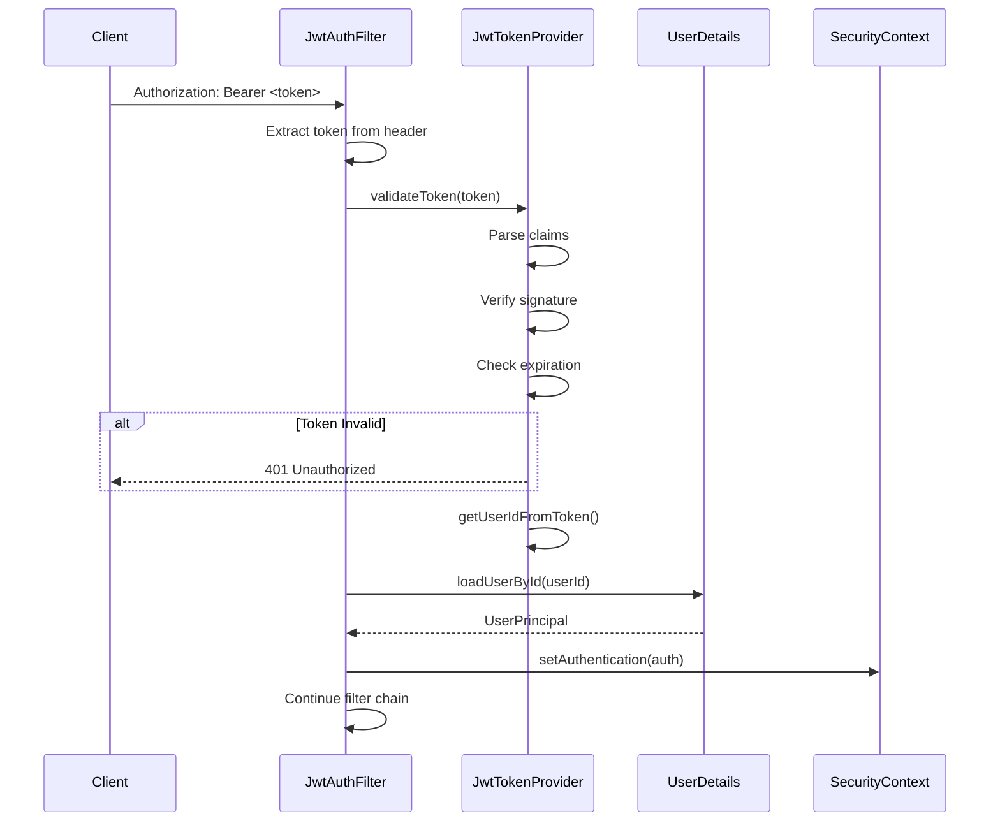
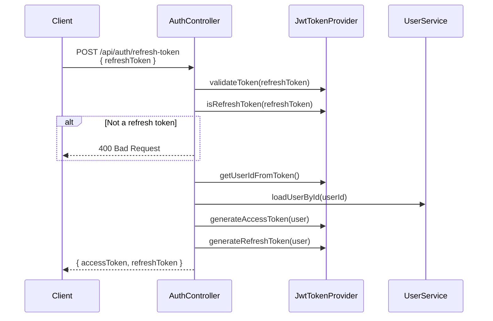

# JWT Lifecycle

Complete lifecycle of JSON Web Tokens in StayMate.

---

## Token Overview

StayMate uses two token types:

| Token | Purpose | Lifetime | Claims |
|-------|---------|----------|--------|
| **Access Token** | API authentication | 15 minutes | userId, email, roles |
| **Refresh Token** | Token renewal | 7 days | userId, type="refresh" |

---

## Token Lifecycle State Diagram



---

## Token Generation

### JwtTokenProvider Implementation

```java
// JwtTokenProvider.java
@Component
public class JwtTokenProvider {

    @Value("${app.jwt.secret}")
    private String jwtSecret;

    @Value("${app.jwt.access-token-expiration-ms}")
    private long accessTokenExpirationMs;  // 900000 (15 min)

    @Value("${app.jwt.refresh-token-expiration-ms}")
    private long refreshTokenExpirationMs;  // 604800000 (7 days)

    private SecretKey key;

    @PostConstruct
    public void init() {
        byte[] keyBytes = Decoders.BASE64.decode(jwtSecret);
        this.key = Keys.hmacShaKeyFor(keyBytes);
    }

    public String generateAccessToken(UserPrincipal userPrincipal) {
        Date now = new Date();
        Date expiryDate = new Date(now.getTime() + accessTokenExpirationMs);

        String roles = userPrincipal.getAuthorities().stream()
                .map(GrantedAuthority::getAuthority)
                .collect(Collectors.joining(","));

        return Jwts.builder()
                .subject(userPrincipal.getId().toString())
                .claim("email", userPrincipal.getEmail())
                .claim("roles", roles)
                .issuedAt(now)
                .expiration(expiryDate)
                .signWith(key)
                .compact();
    }

    public String generateRefreshToken(UserPrincipal userPrincipal) {
        Date now = new Date();
        Date expiryDate = new Date(now.getTime() + refreshTokenExpirationMs);

        return Jwts.builder()
                .subject(userPrincipal.getId().toString())
                .claim("type", "refresh")  // Marks as refresh token
                .issuedAt(now)
                .expiration(expiryDate)
                .signWith(key)
                .compact();
    }
}
```

---

## Token Structure

### Access Token Claims

```json
{
  "sub": "42",
  "email": "user@example.com",
  "roles": "ROLE_USER,ROLE_HOUSE_OWNER",
  "iat": 1705836000,
  "exp": 1705836900
}
```

### Refresh Token Claims

```json
{
  "sub": "42",
  "type": "refresh",
  "iat": 1705836000,
  "exp": 1706440800
}
```

---

## Token Validation Flow



---

## Validation Logic

```java
public boolean validateToken(String authToken) {
    try {
        Jwts.parser()
                .verifyWith(key)
                .build()
                .parseSignedClaims(authToken);
        return true;
    } catch (SignatureException ex) {
        logger.error("Invalid JWT signature");
    } catch (MalformedJwtException ex) {
        logger.error("Invalid JWT token");
    } catch (ExpiredJwtException ex) {
        logger.error("Expired JWT token");
    } catch (UnsupportedJwtException ex) {
        logger.error("Unsupported JWT token");
    } catch (IllegalArgumentException ex) {
        logger.error("JWT claims string is empty");
    }
    return false;
}
```

---

## Refresh Flow



---

## Configuration

```properties
# application.properties
app.jwt.secret=${JWT_SECRET}
app.jwt.access-token-expiration-ms=900000      # 15 minutes
app.jwt.refresh-token-expiration-ms=604800000  # 7 days
```

!!! danger "Secret Management"
    Never commit `JWT_SECRET` to version control. Use environment variables or secret managers.
