# Rate Limiting

Token bucket rate limiting implementation.

---

## Overview

StayMate uses a **token bucket algorithm** to prevent abuse and ensure fair resource allocation.

```mermaid
graph LR
    subgraph "Token Bucket"
        BUCKET["🪣 Bucket<br/>200 tokens max"]
        REFILL["⏰ Refill<br/>200/minute"]
    end

    REQ["Request"] --> CHECK{Tokens available?}
    CHECK -->|Yes| CONSUME["Consume 1 token"]
    CONSUME --> ALLOW["✅ Allow"]
    CHECK -->|No| REJECT["❌ 429 Too Many Requests"]

    REFILL --> BUCKET
```



---

## Configuration

```properties
# application.properties
rate.limit.enabled=true
rate.limit.requests-per-minute=200
```

| Setting | Default | Description |
|---------|---------|-------------|
| `enabled` | true | Enable/disable rate limiting |
| `requests-per-minute` | 200 | Max requests per client per minute |

---

## Implementation

### RateLimitFilter

```java
// RateLimitFilter.java
@Component
public class RateLimitFilter extends OncePerRequestFilter {

    private static final Logger logger = LoggerFactory.getLogger(RateLimitFilter.class);

    @Value("${rate.limit.enabled:true}")
    private boolean rateLimitEnabled;

    @Value("${rate.limit.requests-per-minute:200}")
    private int requestsPerMinute;

    private final Map<String, TokenBucket> buckets = new ConcurrentHashMap<>();

    @Override
    protected void doFilterInternal(
            HttpServletRequest request,
            HttpServletResponse response,
            FilterChain chain) throws ServletException, IOException {

        if (!rateLimitEnabled) {
            chain.doFilter(request, response);
            return;
        }

        String clientId = getClientIdentifier(request);
        TokenBucket bucket = buckets.computeIfAbsent(
            clientId,
            k -> new TokenBucket(requestsPerMinute)
        );

        if (bucket.tryConsume()) {
            chain.doFilter(request, response);
        } else {
            logger.warn("Rate limit exceeded for client: {}", clientId);
            response.setStatus(HttpStatus.TOO_MANY_REQUESTS.value());
            response.setContentType("application/json");
            response.getWriter().write(
                "{\"error\":\"Rate limit exceeded\",\"message\":\"Try again later\"}"
            );
        }
    }

    private String getClientIdentifier(HttpServletRequest request) {
        // Prefer authenticated user ID
        Authentication auth = SecurityContextHolder.getContext().getAuthentication();
        if (auth != null && auth.isAuthenticated() &&
            !"anonymousUser".equals(auth.getPrincipal())) {
            return "user:" + auth.getName();
        }

        // Fall back to IP address
        String xff = request.getHeader("X-Forwarded-For");
        if (xff != null && !xff.isEmpty()) {
            return "ip:" + xff.split(",")[0].trim();
        }
        return "ip:" + request.getRemoteAddr();
    }
}
```

### Token Bucket Algorithm

```java
public class TokenBucket {
    private final int capacity;
    private final double refillRate;  // tokens per millisecond
    private double tokens;
    private long lastRefillTime;

    public TokenBucket(int tokensPerMinute) {
        this.capacity = tokensPerMinute;
        this.refillRate = tokensPerMinute / 60000.0;
        this.tokens = capacity;
        this.lastRefillTime = System.currentTimeMillis();
    }

    public synchronized boolean tryConsume() {
        refill();
        if (tokens >= 1) {
            tokens -= 1;
            return true;
        }
        return false;
    }

    private void refill() {
        long now = System.currentTimeMillis();
        double elapsed = now - lastRefillTime;
        tokens = Math.min(capacity, tokens + elapsed * refillRate);
        lastRefillTime = now;
    }
}
```

---

## Filter Chain Position


The rate limit filter runs **before** JWT authentication to protect against unauthenticated abuse.

---

## Per-Endpoint Limits (Future)

!!! info "Enhancement Opportunity"
    Current implementation uses a global limit. Consider per-endpoint limits:

    ```java
    @RateLimit(value = 10, window = 60)  // 10 per minute
    @PostMapping("/auth/login")
    public ResponseEntity<AuthResponse> login(...) {}
    ```

---

## Response Headers

```http
HTTP/1.1 429 Too Many Requests
Content-Type: application/json
Retry-After: 60

{
  "error": "Rate limit exceeded",
  "message": "Try again later"
}
```

---

## Monitoring

```java
// Future: Add metrics
meterRegistry.counter("rate.limit.exceeded",
    "client", clientId
).increment();
```
