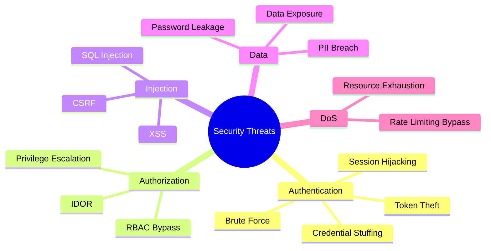

# Security Threat Model

Identified threats and implemented mitigations for StayMate.

---

## Threat Categories



---

## Threat Matrix

| Threat | Severity | Likelihood | Mitigation | Status |
|--------|:--------:|:----------:|------------|:------:|
| Brute Force Login | High | Medium | Rate limiting | ✅ |
| SQL Injection | Critical | Low | JPA/Hibernate | ✅ |
| XSS | High | Medium | Output encoding | ✅ |
| CSRF | Medium | Low | Stateless (JWT) | ✅ |
| Token Theft | High | Medium | Short expiry, HTTPS | ✅ |
| IDOR | High | Medium | Ownership checks | ✅ |
| Privilege Escalation | Critical | Low | RBAC | ✅ |
| Data Exposure | High | Low | DTO pattern | ✅ |

---

## Authentication Threats

### 1. Brute Force Attack

**Threat:** Attacker attempts many password combinations.

**Mitigation:**
```java
// RateLimitFilter.java
@Value("${rate.limit.requests-per-minute:200}")
private int requestsPerMinute;

if (!rateLimiter.tryConsume(clientId)) {
    response.setStatus(429);
    return;
}
```

### 2. Credential Stuffing

**Threat:** Using leaked credentials from other sites.

**Mitigations:**

- BCrypt password hashing (slow to verify)
- OAuth2 as alternative (offload to Google)
- Rate limiting on login endpoint

### 3. Token Theft

**Threat:** Attacker intercepts JWT token.

**Mitigations:**

- Short access token lifetime (15 min)
- Refresh token rotation
- HTTPS only in production

---

## Authorization Threats

### 4. Insecure Direct Object Reference (IDOR)

**Threat:** Accessing other users' resources by changing IDs.

**Mitigation:**
```java
@DeleteMapping("/properties/{id}")
public ResponseEntity<Void> delete(@PathVariable Long id) {
    Property property = propertyRepository.findById(id)
        .orElseThrow(() -> new ResourceNotFoundException("Property", id));

    User currentUser = userService.getCurrentUser();

    // Ownership check prevents IDOR
    if (!property.getOwner().equals(currentUser) && !currentUser.isAdmin()) {
        throw new AccessDeniedException("Not authorized");
    }

    propertyRepository.delete(property);
    return ResponseEntity.noContent().build();
}
```

### 5. Privilege Escalation

**Threat:** User gains higher privileges than authorized.

**Mitigation:**
```java
// Role changes require admin approval
@PreAuthorize("hasRole('ADMIN')")
@PostMapping("/users/{id}/roles")
public ResponseEntity<Void> updateRoles(...) {
    // Only admins can modify roles
}
```

---

## Injection Threats

### 6. SQL Injection

**Threat:** Malicious SQL in user input.

**Mitigation:**
```java
// JPA uses parameterized queries automatically
@Query("SELECT p FROM Property p WHERE p.title LIKE %:search%")
List<Property> search(@Param("search") String search);

// Search input is parameterized, never concatenated
```

### 7. Cross-Site Scripting (XSS)

**Threat:** Malicious scripts in user content.

**Mitigations:**

- Input validation (Bean Validation)
- Output encoding (Jackson JSON serialization)
- Content-Type headers

---

## Data Protection

### 8. Password Handling

```java
@Bean
public PasswordEncoder passwordEncoder() {
    return new BCryptPasswordEncoder(10);  // Strength 10
}

// Never store plaintext
user.setPassword(passwordEncoder.encode(request.getPassword()));
```

### 9. Sensitive Data in Logs

```java
// ❌ Never log passwords or tokens
log.info("Login with password: {}", password);

// ✅ Log only safe identifiers
log.info("Login attempt for user: {}", email);
```

### 10. Response Data Filtering

```java
// Entity has password hash
@Entity
public class User {
    private String password;  // BCrypt hash
}

// DTO excludes sensitive fields
public class UserResponse {
    private Long id;
    private String email;
    // No password field
}
```

---

## Security Checklist

| Category | Check | Implementation |
|----------|-------|----------------|
| Auth | Rate limiting | `RateLimitFilter` |
| Auth | Password hashing | BCrypt |
| Auth | Token expiry | 15 min access, 7 day refresh |
| AuthZ | RBAC enforcement | `@PreAuthorize` |
| AuthZ | Ownership validation | Service layer checks |
| Input | Validation | Bean Validation |
| Input | SQL injection | JPA parameterized |
| Output | Data filtering | DTO pattern |
| Transport | HTTPS | Nginx/cloud |
