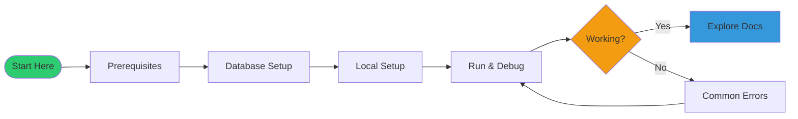

# Setup

This section provides everything you need to get StayMate running locally.

---

## Quick Start (TL;DR)

```bash
# 1. Prerequisites
java -version   # Java 17+
mvn -version    # Maven 3.8+
mysql --version # MySQL 8.0+

# 2. Start dependencies
docker-compose up -d  # Starts MinIO

# 3. Configure database
mysql -u root -p -e "CREATE DATABASE authdb;"

# 4. Run application
cd server
./mvnw spring-boot:run

# 5. Verify
curl http://localhost:8080/actuator/health
```

---

## In This Section

| Document | Description | Time |
|----------|-------------|------|
| [Prerequisites](prerequisites.md) | Required software | 5 min |
| [Local Setup](local-setup.md) | Step-by-step guide | 15 min |
| [Database Setup](database-setup.md) | MySQL configuration | 10 min |
| [Run & Debug](run-and-debug.md) | IDE and debugging | 10 min |
| [Common Errors](common-errors.md) | Troubleshooting | Reference |

---

## Onboarding Path


