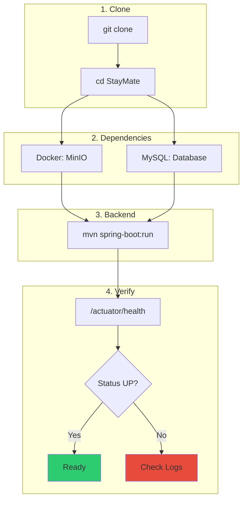

# Local Setup

Complete step-by-step guide to run StayMate locally.

---

## Startup Flow



---

## Step 1: Clone Repository

```bash
git clone https://github.com/your-org/StayMate.git
cd StayMate
```

Verify structure:
```
StayMate/
├── server/              # Spring Boot backend
├── client/              # Next.js frontend
├── staymate-mkdocs/     # Documentation
├── load-testing/        # k6 & JMeter tests
└── docker-compose.yml   # MinIO container
```

---

## Step 2: Start Dependencies

### MinIO (Object Storage)

```bash
# Start MinIO container
docker-compose up -d

# Verify MinIO is running
docker ps | grep minio
```

Expected:
```
staymate-minio   minio/minio:latest   ...   0.0.0.0:9005->9000/tcp, 0.0.0.0:9006->9001/tcp
```

!!! tip "MinIO Console"
    Access MinIO Console at [http://localhost:9006](http://localhost:9006)

    - Username: `minioadmin`
    - Password: `minioadmin`

### MySQL

Ensure MySQL is running (see [Database Setup](database-setup.md)):

```bash
# macOS
brew services list | grep mysql

# Linux
sudo systemctl status mysql
```

---

## Step 3: Configure Environment (Optional)

Default values work for development. For custom config:

```bash
# Create .env file
cat > server/.env << 'EOF'
DB_HOST=localhost
DB_PORT=3306
DB_NAME=authdb
DB_USERNAME=root
DB_PASSWORD=your_password
JWT_SECRET=your-base64-encoded-secret
EOF
```

---

## Step 4: Build & Run Backend

```bash
cd server

# Download dependencies (first time only)
./mvnw dependency:resolve

# Run application
./mvnw spring-boot:run
```

### Expected Output

```
  .   ____          _            __ _ _
 /\\ / ___'_ __ _ _(_)_ __  __ _ \ \ \ \
( ( )\___ | '_ | '_| | '_ \/ _` | \ \ \ \
 \\/  ___)| |_)| | | | | || (_| |  ) ) ) )
  '  |____| .__|_| |_|_| |_\__, | / / / /
 =========|_|==============|___/=/_/_/_/
 :: Spring Boot ::                (v3.2.0)

...
INFO  --- Flyway Community Edition 9.22.3
INFO  --- Successfully validated 55 migrations
INFO  --- Successfully applied 55 migrations
...
INFO  --- Started Application in 8.234 seconds
INFO  --- Tomcat started on port 8080
```

!!! warning "First Startup"
    First startup takes longer due to:

    - Maven downloading dependencies
    - Flyway running 55+ migrations
    - MinIO bucket creation

    Subsequent starts are much faster.

---

## Step 5: Verify

### Health Check

```bash
curl http://localhost:8080/actuator/health
```

Expected:
```json
{
  "status": "UP"
}
```

### Test Authentication

```bash
# Register a user
curl -X POST http://localhost:8080/api/auth/register \
  -H "Content-Type: application/json" \
  -d '{
    "email": "test@example.com",
    "password": "Test123!",
    "firstName": "Test",
    "lastName": "User"
  }'
```

Expected:
```json
{
  "accessToken": "eyJhbGciOiJIUzI1NiIs...",
  "refreshToken": "eyJhbGciOiJIUzI1NiIs...",
  "tokenType": "Bearer",
  "expiresIn": 900000
}
```

### Test Protected Endpoint

```bash
# Use the accessToken from above
curl http://localhost:8080/api/auth/me \
  -H "Authorization: Bearer <accessToken>"
```

---

## Step 6: Access Points

| Service | URL | Purpose |
|---------|-----|---------|
| **API** | http://localhost:8080 | Backend API |
| **Health** | http://localhost:8080/actuator/health | Health check |
| **Swagger** | http://localhost:8080/swagger-ui.html | API docs |
| **MinIO Console** | http://localhost:9006 | Object storage |
| **MinIO API** | http://localhost:9005 | S3-compatible API |

---

## Next Step

→ [Run & Debug](run-and-debug.md)
